```python
import pandas as pd 
import numpy as np 
from scipy import stats
import glob
import seaborn as sns
import matplotlib.pyplot as plt
import scipy
from scipy import signal
```


```python
als=sorted(glob.glob('alpha*A.txt.xlsx'))
bls=sorted(glob.glob('alpha*B.txt.xlsx'))
```


```python
def func (ls):
    global ocbl,fpdo,ocdo,fpbl
    
    ocbl=pd.DataFrame()
    fpdo=pd.DataFrame()
    ocdo=pd.DataFrame()
    fpbl=pd.DataFrame()

    for data in ls:
    
        df=pd.read_excel(data)
    
        ocbl=pd.concat([ocbl, pd.DataFrame(stats.zscore(df.o1_alpha+df.o2_alpha))], axis=1 ,ignore_index=True)
        fpdo=pd.concat([fpdo, pd.DataFrame(stats.zscore((df.fp2_alpha-df.fp1_alpha)/(df.fp1_alpha+df.fp2_alpha)))], axis=1 ,ignore_index=True)
        ocdo=pd.concat([ocdo, pd.DataFrame(stats.zscore((df.o2_alpha-df.o1_alpha)/(df.o1_alpha+df.o2_alpha)))], axis=1 ,ignore_index=True)
        fpbl=pd.concat([fpbl, pd.DataFrame(stats.zscore(df.fp1_alpha+df.f3_alpha))], axis=1 ,ignore_index=True)
    
    return print('done')
```


```python
func(als)
al = pd.DataFrame()
al['ocbl'] = ocbl.median(axis=1)
al['fpdo'] = fpdo.median(axis=1)
al['ocdo'] = ocdo.median(axis=1)
al['fpbl'] = fpbl.median(axis=1)
```

    done
    


```python
func(bls)
bl = pd.DataFrame()
bl['ocbl'] = ocbl.median(axis=1)
bl['fpdo'] = fpdo.median(axis=1)
bl['ocdo'] = ocdo.median(axis=1)
bl['fpbl'] = fpbl.median(axis=1)
```

    done
    

### 1. Total Occipital alpha


```python
a=al[131000:136000]
b=bl[319000:324000]
a
        
result = pd.DataFrame({ 
                        'Front': [a.ocbl.mean()],
                        'Back': [b.ocbl.mean()]
                        
                        
                
    
})

sns.set(font_scale=1.5) 
sns.set_style("white")
result.plot.bar(title="Total Occipital alpha: Front vs Back")

s=2
s1=6
s2=10
s3=14

plt.axvspan(s,s, color='black', alpha=1)
plt.axvspan(s1,s1, color='red', alpha=1)
plt.axvspan(s2,s2, color='red', alpha=1)
plt.axvspan(s3,s3, color='red', alpha=1)

plt.axhspan(0, 0, color='black', alpha=1)

plt.gcf().set_size_inches(12,8)

```


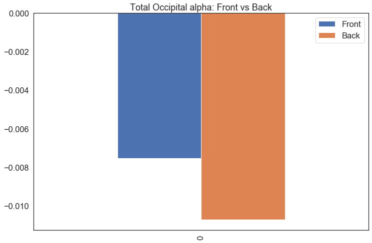


```python
acopy=al[130000:137500]
bcopy= bl[318000:325500]

aa=acopy.ocbl
bb=bcopy.ocbl
        
result = pd.DataFrame({ 
                        'Front': aa.reset_index(drop=True),
                        'Back': bb.reset_index(drop=True)
                
    
})


sns.set_style("white")
result.plot(title="Total Occipital alpha: Front vs Back")


plt.axvspan(3000,4000, color='gray', alpha=0.2)
plt.axvspan(1000,1000, color='red', alpha=1)
plt.axvspan(6000,6000, color='red', alpha=1)

#plt.axvspan(10,60, color='gray', alpha=0.2)

plt.axhspan(0, 0, color='black', alpha=1)

plt.gcf().set_size_inches(20,6)

```


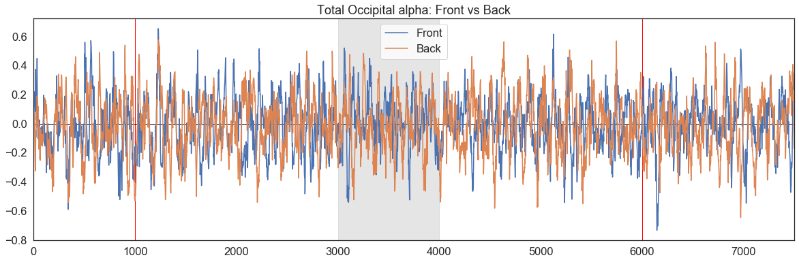


```python
N=200
acopy=al[130000:137500]
bcopy= bl[318000:325500]

aa=acopy.ocbl.rolling(N).mean()
bb=bcopy.ocbl.rolling(N).mean()
        
result = pd.DataFrame({ 
                        'Front': aa.reset_index(drop=True),
                        'Back': bb.reset_index(drop=True)
                
    
})


sns.set_style("white")
result.plot(title="Total Occipital alpha: Front vs Back")


plt.axvspan(3000,4000, color='gray', alpha=0.2)
plt.axvspan(1000,1000, color='red', alpha=1)
plt.axvspan(6000,6000, color='red', alpha=1)

#plt.axvspan(10,60, color='gray', alpha=0.2)

plt.axhspan(0, 0, color='black', alpha=1)

plt.gcf().set_size_inches(20,6)

```


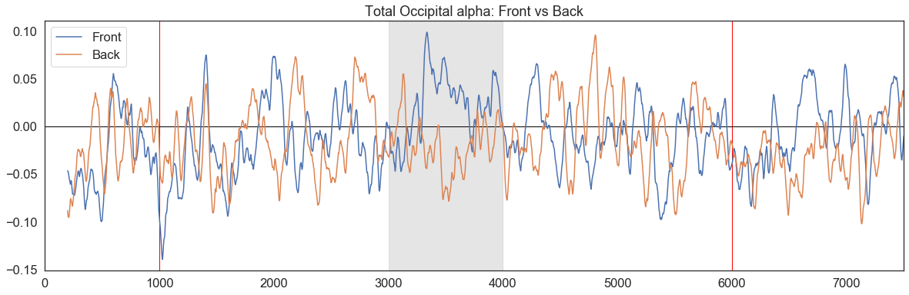


```python
N=100
acopy=al[130000:137500]
bcopy= bl[318000:325500]

aa=acopy.ocbl.groupby(np.arange(len(acopy))//N).mean()
bb=bcopy.ocbl.groupby(np.arange(len(bcopy))//N).mean()
        
result = pd.DataFrame({ 
                        'Front': aa,
                        'Back': bb
                
    
})


sns.set_style("white")
result.plot(title="Total Occipital alpha: Front vs Back")


plt.axvspan(30,40, color='gray', alpha=0.2)
plt.axvspan(10,10, color='red', alpha=1)
plt.axvspan(60,60, color='red', alpha=1)

#plt.axvspan(10,60, color='gray', alpha=0.2)

plt.axhspan(0, 0, color='black', alpha=1)

plt.gcf().set_size_inches(20,6)

```


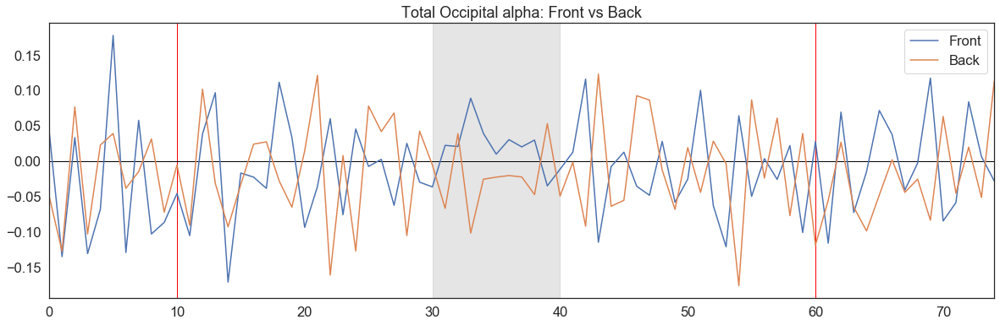


```python
N=500
acopy=al[130000:137500]
bcopy= bl[318000:325500]

aa=acopy.ocbl.groupby(np.arange(len(acopy))//N).mean()
bb=bcopy.ocbl.groupby(np.arange(len(bcopy))//N).mean()
        
result = pd.DataFrame({ 
                        'Front': aa,
                        'Back': bb
                
    
})


sns.set_style("white")
result.plot(title="Total Occipital alpha: Front vs Back")


plt.axvspan(30,40, color='gray', alpha=0.2)
plt.axvspan(2,2, color='red', alpha=1)
plt.axvspan(12,12, color='red', alpha=1)

plt.axvspan(5.5,8.5, color='gray', alpha=0.2)

plt.axhspan(0, 0, color='black', alpha=1)

plt.gcf().set_size_inches(20,6)

```


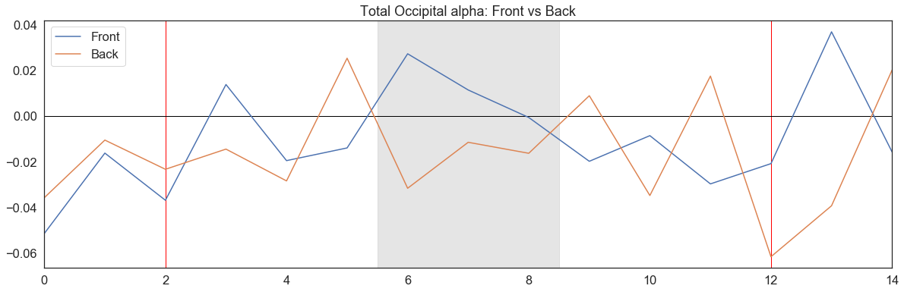


### 2. Occipital Alpha Dominance


```python
a=al[131000:136000]
b=bl[319000:324000]

        
result = pd.DataFrame({ 
                        'Front': [a.ocdo.mean()],
                        'Back': [b.ocdo.mean()]
                        
                        
                
    
})

sns.set(font_scale=1.5) 
sns.set_style("white")
result.plot.bar(title="Occipital alpha Dominance: Front vs Back")

s=2
s1=6
s2=10
s3=14

plt.axvspan(s,s, color='black', alpha=1)
plt.axvspan(s1,s1, color='red', alpha=1)
plt.axvspan(s2,s2, color='red', alpha=1)
plt.axvspan(s3,s3, color='red', alpha=1)

plt.axhspan(0, 0, color='black', alpha=1)

plt.gcf().set_size_inches(12,8)

```


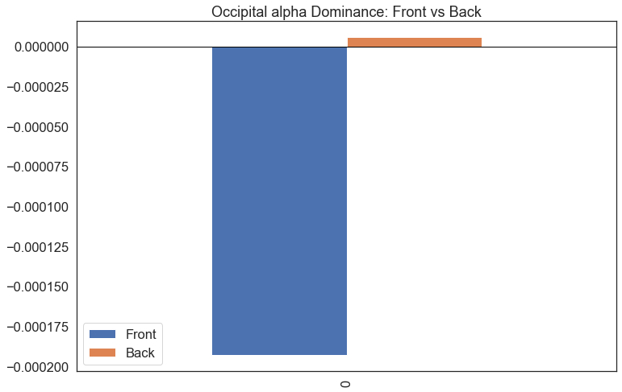


```python
acopy=al[130000:137500]
bcopy= bl[318000:325500]

aa=acopy.ocdo
bb=bcopy.ocdo
        
result = pd.DataFrame({ 
                        'Front': aa.reset_index(drop=True),
                        'Back': bb.reset_index(drop=True)
                
    
})


sns.set_style("white")
result.plot(title="Occipital alpha Dominance: Front vs Back")


#plt.axvspan(3000,4000, color='gray', alpha=0.2)
plt.axvspan(1000,1000, color='red', alpha=1)
plt.axvspan(6000,6000, color='red', alpha=1)

#plt.axvspan(10,60, color='gray', alpha=0.2)

plt.axhspan(0, 0, color='black', alpha=1)

plt.gcf().set_size_inches(20,6)

```


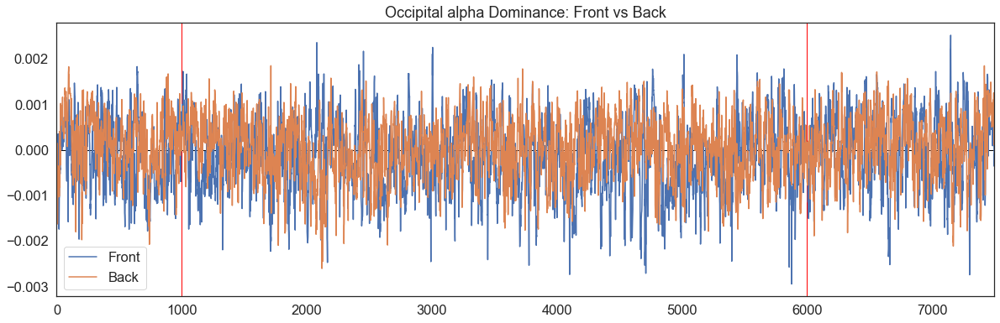


```python
N=200
acopy=al[130000:137500]
bcopy= bl[318000:325500]

aa=acopy.ocdo.rolling(N).mean()
bb=bcopy.ocdo.rolling(N).mean()
        
result = pd.DataFrame({ 
                        'Front': aa.reset_index(drop=True),
                        'Back': bb.reset_index(drop=True)
                
    
})


sns.set_style("white")
result.plot(title="Occipital alpha Dominance: Front vs Back")


#plt.axvspan(3000,4000, color='gray', alpha=0.2)
plt.axvspan(1000,1000, color='red', alpha=1)
plt.axvspan(6000,6000, color='red', alpha=1)

#plt.axvspan(10,60, color='gray', alpha=0.2)

plt.axhspan(0, 0, color='black', alpha=1)

plt.gcf().set_size_inches(20,6)

```


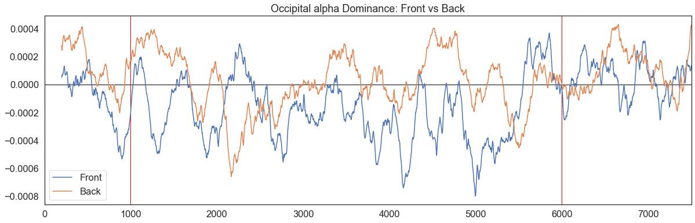


```python
N=100
acopy=al[130000:137500]
bcopy= bl[318000:325500]

aa=acopy.ocdo.groupby(np.arange(len(acopy))//N).mean()
bb=bcopy.ocdo.groupby(np.arange(len(bcopy))//N).mean()
        
result = pd.DataFrame({ 
                        'Front': aa,
                        'Back': bb
                
    
})


sns.set_style("white")
result.plot(title="Occipital alpha Dominance: Front vs Back")


plt.axvspan(30,40, color='gray', alpha=0.2)
plt.axvspan(10,10, color='red', alpha=1)
plt.axvspan(60,60, color='red', alpha=1)

#plt.axvspan(10,60, color='gray', alpha=0.2)

plt.axhspan(0, 0, color='black', alpha=1)

plt.gcf().set_size_inches(20,6)

```


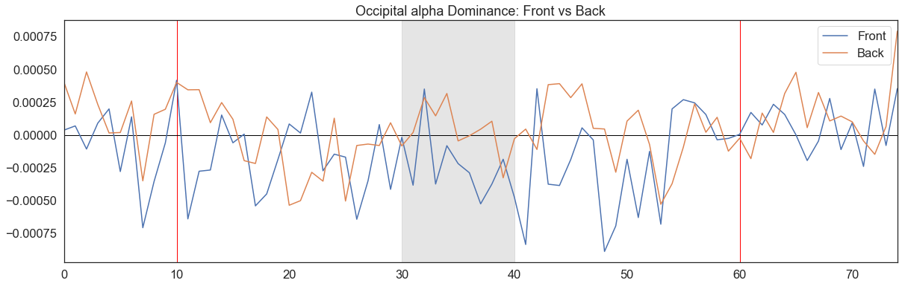


```python
N=500
acopy=al[130000:137500]
bcopy= bl[318000:325500]

aa=acopy.ocdo.groupby(np.arange(len(acopy))//N).mean()
bb=bcopy.ocdo.groupby(np.arange(len(bcopy))//N).mean()
        
result = pd.DataFrame({ 
                        'Front': aa,
                        'Back': bb
                
    
})


sns.set_style("white")
result.plot(title="Occipital alpha Dominance: Front vs Back")


plt.axvspan(30,40, color='gray', alpha=0.2)
plt.axvspan(2,2, color='red', alpha=1)
plt.axvspan(12,12, color='red', alpha=1)

#plt.axvspan(5,10, color='gray', alpha=0.2)

plt.axhspan(0, 0, color='black', alpha=1)

plt.gcf().set_size_inches(20,6)

```


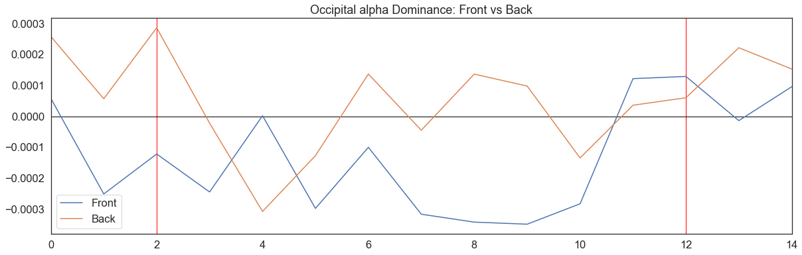


### 3. Frontal Alpha Dominance


```python
a=al[131000:136000]
b=bl[319000:324000]

        
result = pd.DataFrame({ 
                        'Front': [a.fpdo.mean()],
                        'Back': [b.fpdo.mean()]
                        
                        
                
    
})

sns.set(font_scale=1.5) 
sns.set_style("white")
result.plot.bar(title="Frontal alpha Dominance: Front vs Back")

s=2
s1=6
s2=10
s3=14

plt.axvspan(s,s, color='black', alpha=1)
plt.axvspan(s1,s1, color='red', alpha=1)
plt.axvspan(s2,s2, color='red', alpha=1)
plt.axvspan(s3,s3, color='red', alpha=1)

plt.axhspan(0, 0, color='black', alpha=1)

plt.gcf().set_size_inches(12,8)

```


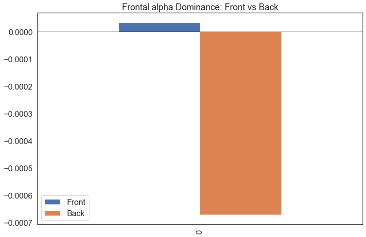


```python
acopy=al[130000:137500]
bcopy= bl[318000:325500]

aa=acopy.fpdo
bb=bcopy.fpdo
        
result = pd.DataFrame({ 
                        'Front': aa.reset_index(drop=True),
                        'Back': bb.reset_index(drop=True)
                
    
})


sns.set_style("white")
result.plot(title="Frontal alpha Dominance: Front vs Back")


#plt.axvspan(3000,4000, color='gray', alpha=0.2)
plt.axvspan(1000,1000, color='red', alpha=1)
plt.axvspan(6000,6000, color='red', alpha=1)

#plt.axvspan(10,60, color='gray', alpha=0.2)

plt.axhspan(0, 0, color='black', alpha=1)

plt.gcf().set_size_inches(20,6)

```


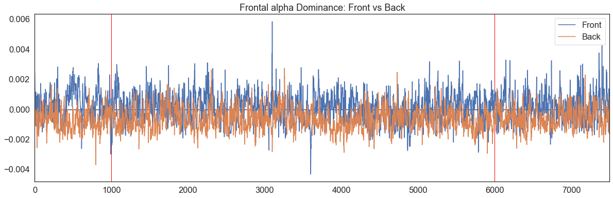


```python
N=200
acopy=al[130000:137500]
bcopy= bl[318000:325500]

aa=acopy.fpdo.rolling(N).mean()
bb=bcopy.fpdo.rolling(N).mean()
        
result = pd.DataFrame({ 
                        'Front': aa.reset_index(drop=True),
                        'Back': bb.reset_index(drop=True)
                
    
})


sns.set_style("white")
result.plot(title="Frontal alpha Dominance: Front vs Back")


#plt.axvspan(3000,4000, color='gray', alpha=0.2)
plt.axvspan(1000,1000, color='red', alpha=1)
plt.axvspan(6000,6000, color='red', alpha=1)

#plt.axvspan(10,60, color='gray', alpha=0.2)

plt.axhspan(0, 0, color='black', alpha=1)

plt.gcf().set_size_inches(20,6)

```


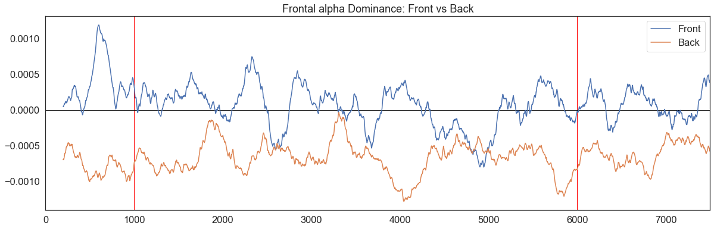


```python
N=100
acopy=al[130000:137500]
bcopy= bl[318000:325500]

aa=acopy.fpdo.groupby(np.arange(len(acopy))//N).mean()
bb=bcopy.fpdo.groupby(np.arange(len(bcopy))//N).mean()
        
result = pd.DataFrame({ 
                        'Front': aa,
                        'Back': bb
                
    
})


sns.set_style("white")
result.plot(title="Frontal alpha Dominance: Front vs Back")


#plt.axvspan(30,40, color='gray', alpha=0.2)
plt.axvspan(10,10, color='red', alpha=1)
plt.axvspan(60,60, color='red', alpha=1)

#plt.axvspan(10,60, color='gray', alpha=0.2)

plt.axhspan(0, 0, color='black', alpha=1)

plt.gcf().set_size_inches(20,6)

```


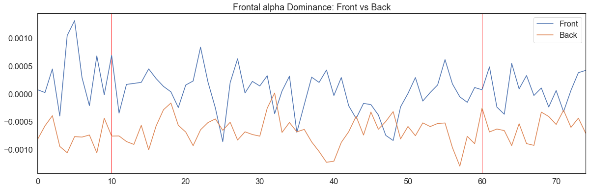


```python
N=500
acopy=al[130000:137500]
bcopy= bl[318000:325500]

aa=acopy.fpdo.groupby(np.arange(len(acopy))//N).mean()
bb=bcopy.fpdo.groupby(np.arange(len(bcopy))//N).mean()
        
result = pd.DataFrame({ 
                        'Front': aa,
                        'Back': bb
                
    
})


sns.set_style("white")
result.plot(title="Frontal alpha Dominance: Front vs Back")


plt.axvspan(30,40, color='gray', alpha=0.2)
plt.axvspan(2,2, color='red', alpha=1)
plt.axvspan(12,12, color='red', alpha=1)

#plt.axvspan(5,10, color='gray', alpha=0.2)

plt.axhspan(0, 0, color='black', alpha=1)

plt.gcf().set_size_inches(20,6)


```


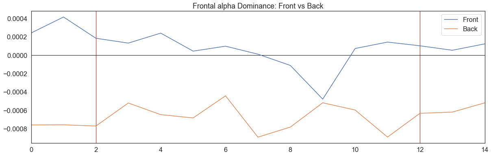


```python
al.to_excel('1000분의 1초 데이터 분석_(광고 위치_ 앞).xlsx')
bl.to_excel('1000분의 1초 데이터 분석_(광고 위치_ 뒤).xlsx')
```


```python

```
