# 분석


```python
import pandas as pd 
import numpy as np 
from scipy import stats
import glob
import seaborn as sns
import matplotlib.pyplot as plt
import scipy
from scipy import signal
```


```python
ls=sorted(glob.glob("recall*.xlsx"))
print(ls)
print(len(ls))

```

    ['recall no 100분의 1초 sample 1.xlsx', 'recall no 100분의 1초 sample 2.xlsx', 'recall no 100분의 1초 sample 3.xlsx', 'recall no 100분의 1초 sample 4.xlsx', 'recall no 100분의 1초 sample 5.xlsx', 'recall yes 100분의 1초.xlsx']
    6


```python
pd.read_excel(ls[0]).head() #피험자 번호 101A의 뇌파데이터 확인
```


<div>
<style scoped>
    .dataframe tbody tr th:only-of-type {
        vertical-align: middle;
    }

    .dataframe tbody tr th {
        vertical-align: top;
    }

    .dataframe thead th {
        text-align: right;
    }
</style>
<table border="1" class="dataframe">
  <thead>
    <tr style="text-align: right;">
      <th></th>
      <th>o1_alpha</th>
      <th>o2_alpha</th>
      <th>fp1_alpha</th>
      <th>fp2_alpha</th>
      <th>occ_blocking</th>
      <th>occ_asymmetry</th>
      <th>fp_asymmetry</th>
      <th>index</th>
    </tr>
  </thead>
  <tbody>
    <tr>
      <th>0</th>
      <td>-0.124828</td>
      <td>0.496647</td>
      <td>0.102974</td>
      <td>-0.146172</td>
      <td>0.371819</td>
      <td>1.671448</td>
      <td>5.767520</td>
      <td>30332</td>
    </tr>
    <tr>
      <th>1</th>
      <td>0.213357</td>
      <td>0.275406</td>
      <td>-0.143956</td>
      <td>-0.190776</td>
      <td>0.488763</td>
      <td>0.126953</td>
      <td>0.139874</td>
      <td>30333</td>
    </tr>
    <tr>
      <th>2</th>
      <td>-0.026344</td>
      <td>-0.109385</td>
      <td>0.078570</td>
      <td>-0.030911</td>
      <td>-0.135729</td>
      <td>0.611811</td>
      <td>-2.297190</td>
      <td>30334</td>
    </tr>
    <tr>
      <th>3</th>
      <td>-0.539518</td>
      <td>-0.153977</td>
      <td>-0.070051</td>
      <td>0.242281</td>
      <td>-0.693494</td>
      <td>-0.555940</td>
      <td>1.813467</td>
      <td>30335</td>
    </tr>
    <tr>
      <th>4</th>
      <td>-0.473961</td>
      <td>-0.426184</td>
      <td>-0.134402</td>
      <td>0.152739</td>
      <td>-0.900144</td>
      <td>-0.053077</td>
      <td>15.658682</td>
      <td>30336</td>
    </tr>
  </tbody>
</table>
</div>


```python
n1=pd.read_excel(ls[0])
n2=pd.read_excel(ls[1])
n3=pd.read_excel(ls[2])
n4=pd.read_excel(ls[3])
n5=pd.read_excel(ls[4])
y=pd.read_excel(ls[5])
```


```python
import numpy

def smooth(x,window_len=11,window='hanning'):

    if x.ndim != 1:
        raise ValueError ("smooth only accepts 1 dimension arrays.")

    if x.size < window_len:
        raise ValueError ("Input vector needs to be bigger than window size.")


    if window_len<3:
        return x


    if not window in ['flat', 'hanning', 'hamming', 'bartlett', 'blackman']:
        raise ValueError ("Window is on of 'flat', 'hanning', 'hamming', 'bartlett', 'blackman'")


    s=numpy.r_[x[window_len-1:0:-1],x,x[-2:-window_len-1:-1]]
    #print(len(s))
    if window == 'flat': #moving average
        w=numpy.ones(window_len,'d')
    else:
        w=eval('numpy.'+window+'(window_len)')

    y=numpy.convolve(w/w.sum(),s,mode='valid')
    return y

```

## 1. Attention Index


```python
W=257
O=3
aiy=signal.savgol_filter(-(y.fp1_alpha)**2,W,O)
ain1=signal.savgol_filter(-(n1.fp1_alpha)**2,W,O)
ain2=signal.savgol_filter(-(n2.fp1_alpha)**2,W,O)
ain3=signal.savgol_filter(-(n3.fp1_alpha)**2,W,O)
ain4=signal.savgol_filter(-(n4.fp1_alpha)**2,W,O)
ain5=signal.savgol_filter(-(n5.fp1_alpha)**2,W,O)
```


```python
#Attention
result = pd.DataFrame({
                      'recall YES': aiy,
                     #  'recall NO': ain1,
                      #  'recall NO 2': ain2,
                       # 'recall NO 3': ain3,
                        'recall NO ': ain4,
                      #  'recall NO 5': ain5,
})

sns.set_style("white")
result.plot(title="Attention: Group Y vs N")

plt.axvspan(500, 510, color='red', alpha=0.5)
plt.axvspan(600, 610, color='red', alpha=0.5)
plt.axvspan(750, 760, color='red', alpha=0.5)
plt.axvspan(950, 960, color='red', alpha=0.5)
plt.axvspan(1050, 1060, color='red', alpha=0.5)

plt.gcf().set_size_inches(12,8)
```


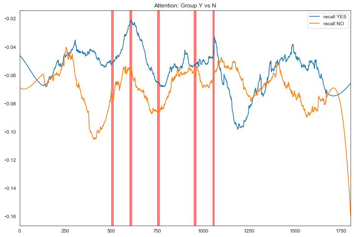


## 2.Approach Index


```python
awy=(y.fp2_alpha)**2-(y.fp1_alpha)**2
awn1=(n1.fp2_alpha)**2-(n1.fp1_alpha)**2
awn2=(n2.fp2_alpha)**2-(n2.fp1_alpha)**2
awn3=(((n3.fp2_alpha)**2)-(n3.fp1_alpha)**2)
awn4=(((n4.fp2_alpha)**2)-(n4.fp1_alpha)**2)
awn5=(((n5.fp2_alpha)**2)-(n5.fp1_alpha)**2)

W=257
O=3
awy=signal.savgol_filter(awy,W,O)
awn1=signal.savgol_filter(awn1,W,O)
awn2=signal.savgol_filter(awn2,W,O)
awn3=signal.savgol_filter(awn3,W,O)
awn4=signal.savgol_filter(awn4,W,O)
awn5=signal.savgol_filter(awn5,W,O)
```


```python
#Approach
result = pd.DataFrame({
                      'recall YES': awy,
                     #  'recall NO': awn1,
                      #  'recall NO 2': awn2,
                       # 'recall NO 3': awn3,
                        'recall NO ': awn4,
                      #  'recall NO 5': awn5,
})

sns.set_style("white")
result.plot(title="Approach: Group Y vs N")

plt.axvspan(500, 510, color='red', alpha=0.5)
plt.axvspan(600, 610, color='red', alpha=0.5)
plt.axvspan(750, 760, color='red', alpha=0.5)
plt.axvspan(950, 960, color='red', alpha=0.5)
plt.axvspan(1050, 1060, color='red', alpha=0.5)

plt.gcf().set_size_inches(12,8)
```


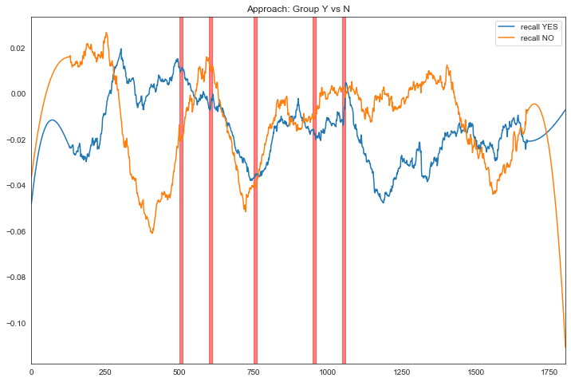


## 3. Occ. Alpha Blocking


```python

result = pd.DataFrame({
                      'recall YES': y.occ_blocking,
                      # 'recall NO 1': ain1,
                       # 'recall NO 2': ain2,
                       # 'recall NO 3': ain3,
                        'recall NO': n4.occ_blocking,
                       # 'recall NO 5': ain5,
})

sns.set_style("white")
result.plot(title="Total Occipital alpha: Group Y vs N")

plt.axvspan(500, 510, color='red', alpha=0.5)
plt.axvspan(600, 610, color='red', alpha=0.5)
plt.axvspan(750, 760, color='red', alpha=0.5)
plt.axvspan(950, 960, color='red', alpha=0.5)
plt.axvspan(1050, 1060, color='red', alpha=0.5)

plt.gcf().set_size_inches(12,8)
```


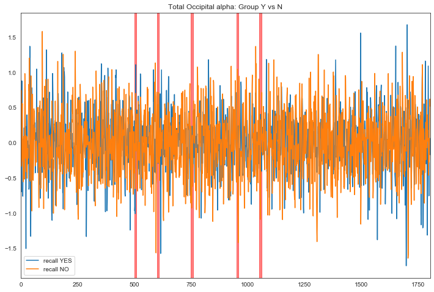


```python
N=150
ocy=smooth(y.occ_blocking,window_len=N,window='hanning')
ocn4=smooth(n4.occ_blocking,window_len=N,window='hanning')
```


```python

result = pd.DataFrame({
                      'recall YES': ocy,
                       #'recall NO 1': ns1,
                      #  'recall NO 2': ns2,
                      #  'recall NO 3': ns3,
                        'recall NO': ocn4,
                        #'recall NO 5': ns5,
})

sns.set_style("white")
result.plot(title="Total occipital alpha: Group Y vs N")

plt.axvspan(500, 510, color='red', alpha=0.5)
plt.axvspan(600, 610, color='red', alpha=0.5)
plt.axvspan(750, 760, color='red', alpha=0.5)
plt.axvspan(950, 960, color='red', alpha=0.5)
plt.axvspan(1050, 1060, color='red', alpha=0.5)

plt.gcf().set_size_inches(12,8)
```


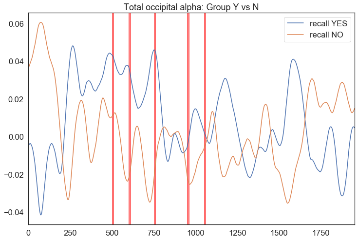


```python
df=pd.DataFrame()
df['Total Occ Alpha'] = (y.occ_blocking[0:500].mean(),y.occ_blocking[500:600].mean(),y.occ_blocking[600:750].mean(),y.occ_blocking[750:950].mean(),y.occ_blocking[950:1050].mean(),y.occ_blocking[1050:].mean())
df['Scene'] =('before the on set','on set', 'out of track','fence hit','2s after','3s after~')
df['RedBull Recall']=('Yes')

dfn=pd.DataFrame()
dfn['Total Occ Alpha']= (n4.occ_blocking[0:500].mean(),n4.occ_blocking[500:600].mean(),n4.occ_blocking[600:750].mean(),n4.occ_blocking[750:950].mean(),n4.occ_blocking[950:1050].mean(),n4.occ_blocking[1050:].mean())
dfn['Scene'] =('before the on set','on set', 'out of track','fence hit','2s after','3s after~')
dfn['RedBull Recall']=('No')

a=pd.concat([df,dfn])

sns.set(style="whitegrid",font_scale=1.5)

ax = sns.barplot(x="Scene", y="Total Occ Alpha",hue="RedBull Recall", data=a)

plt.gcf().set_size_inches(12,8)
```


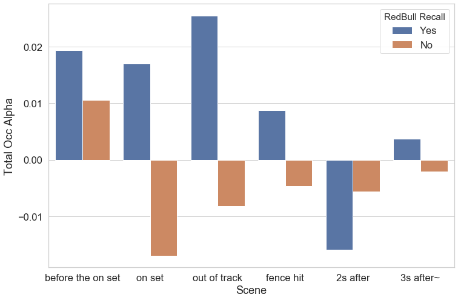


```python
sns.set(style="white",font_scale=1.5)
ax = sns.lineplot(x="Scene", y="Total Occ Alpha",hue="RedBull Recall", data=a, sort=False, linewidth=4)
plt.gcf().set_size_inches(12,8)
```


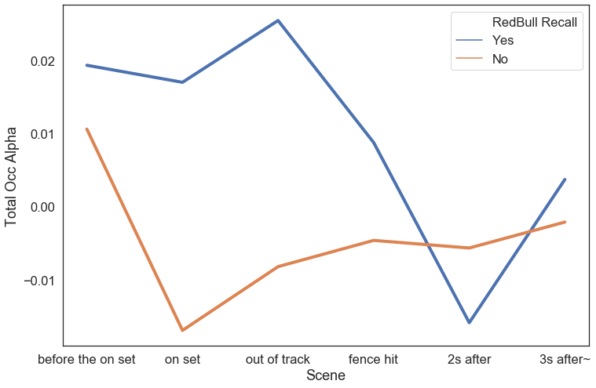


## 4. Left Frontal. Alpha Blocking


```python
N=150
lfy=smooth(y.fp1_alpha,window_len=N,window='hanning')
lfn1=smooth(n1.fp1_alpha,window_len=N,window='hanning')
lfn2=smooth(n2.fp1_alpha,window_len=N,window='hanning')
lfn3=smooth(n3.fp1_alpha,window_len=N,window='hanning')
lfn4=smooth(n4.fp1_alpha,window_len=N,window='hanning')
lfn5=smooth(n5.fp1_alpha,window_len=N,window='hanning')
```


```python

result = pd.DataFrame({
                      'recall YES': lfy,
                       #'recall NO 1': ns1,
                      #  'recall NO 2': ns2,
                      #  'recall NO 3': ns3,
                        'recall NO 4': lfn4,
                        #'recall NO 5': ns5,
})

sns.set_style("white")
result.plot(title="Total left frontal alpha: Group Y vs N")

plt.axvspan(500, 510, color='red', alpha=0.5)
plt.axvspan(600, 610, color='red', alpha=0.5)
plt.axvspan(750, 760, color='red', alpha=0.5)
plt.axvspan(950, 960, color='red', alpha=0.5)
plt.axvspan(1050, 1060, color='red', alpha=0.5)

plt.gcf().set_size_inches(12,8)
```


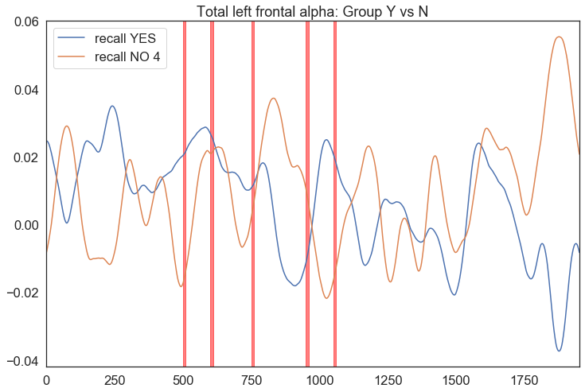


```python
y['fp_blocking']=y.fp1_alpha
n4['fp_blocking']=n4.fp1_alpha
```


```python
df=pd.DataFrame()
df['fp blocking'] = (y.fp_blocking[0:500].mean(),y.fp_blocking[500:600].mean(),y.fp_blocking[600:750].mean(),y.fp_blocking[750:950].mean(),y.fp_blocking[950:1050].mean(),y.fp_blocking[1050:].mean())
df['scene'] =('before the on set','on set', 'out of track','fence hit','2s after','3s after~')
df['recall']=('Yes')

dfn=pd.DataFrame()
dfn['fp blocking']= (n4.fp_blocking[0:500].mean(),n4.fp_blocking[500:600].mean(),n4.fp_blocking[600:750].mean(),n4.fp_blocking[750:950].mean(),n4.fp_blocking[950:1050].mean(),n4.fp_blocking[1050:].mean())
dfn['scene'] =('before the on set','on set', 'out of track','fence hit','2s after','3s after~')
dfn['recall']=('No')

a=pd.concat([df,dfn])

sns.set(style="whitegrid",font_scale=1.5)

ax = sns.barplot(x="scene", y="fp blocking",hue="recall", data=a)

plt.gcf().set_size_inches(12,8)
```


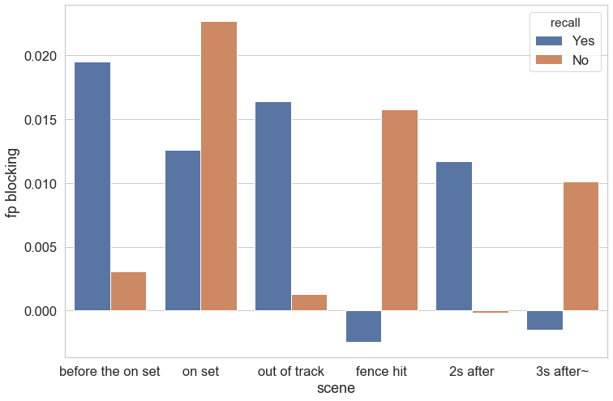


```python
sns.set(style="white",font_scale=1.5)

ax = sns.lineplot(x="scene", y="fp blocking",hue="recall", data=a,sort=False)

plt.gcf().set_size_inches(12,8)
```


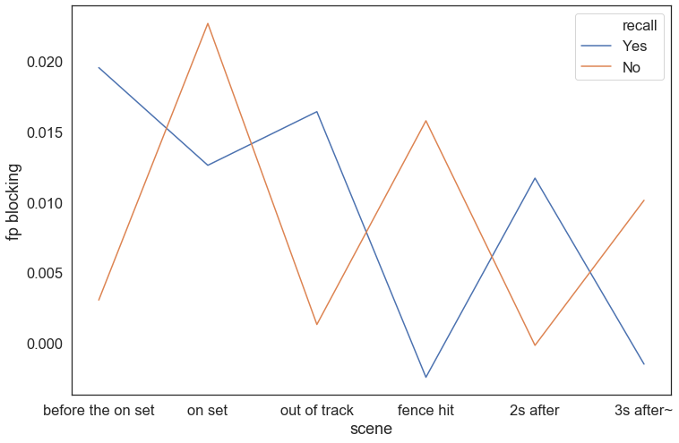


## 5. Frontal Dominance


```python
y.head()
```


<div>
<style scoped>
    .dataframe tbody tr th:only-of-type {
        vertical-align: middle;
    }

    .dataframe tbody tr th {
        vertical-align: top;
    }

    .dataframe thead th {
        text-align: right;
    }
</style>
<table border="1" class="dataframe">
  <thead>
    <tr style="text-align: right;">
      <th></th>
      <th>o1_alpha</th>
      <th>o2_alpha</th>
      <th>fp1_alpha</th>
      <th>fp2_alpha</th>
      <th>occ_blocking</th>
      <th>occ_asymmetry</th>
      <th>fp_asymmetry</th>
      <th>index</th>
    </tr>
  </thead>
  <tbody>
    <tr>
      <th>0</th>
      <td>-0.217358</td>
      <td>-0.037948</td>
      <td>-0.000099</td>
      <td>0.008588</td>
      <td>-0.255306</td>
      <td>-0.702723</td>
      <td>1.023363</td>
      <td>30332</td>
    </tr>
    <tr>
      <th>1</th>
      <td>-0.244282</td>
      <td>-0.049190</td>
      <td>-0.150250</td>
      <td>0.169343</td>
      <td>-0.293472</td>
      <td>-0.664772</td>
      <td>16.738735</td>
      <td>30333</td>
    </tr>
    <tr>
      <th>2</th>
      <td>-0.182536</td>
      <td>-0.515839</td>
      <td>-0.365121</td>
      <td>-0.087001</td>
      <td>-0.698375</td>
      <td>0.477256</td>
      <td>-0.615144</td>
      <td>30334</td>
    </tr>
    <tr>
      <th>3</th>
      <td>-0.056351</td>
      <td>-0.109338</td>
      <td>-0.084976</td>
      <td>-0.107840</td>
      <td>-0.165689</td>
      <td>0.319800</td>
      <td>0.118581</td>
      <td>30335</td>
    </tr>
    <tr>
      <th>4</th>
      <td>0.046002</td>
      <td>0.108742</td>
      <td>-0.172573</td>
      <td>-0.153664</td>
      <td>0.154744</td>
      <td>0.405442</td>
      <td>-0.057961</td>
      <td>30336</td>
    </tr>
  </tbody>
</table>
</div>


```python

result = pd.DataFrame({
                      'recall YES': y.fp_asymmetry,
                       #'recall NO 1': ns1,
                      #  'recall NO 2': ns2,
                      #  'recall NO 3': ns3,
                        'recall NO 4': n4.fp_asymmetry,
                        #'recall NO 5': ns5,
})

sns.set_style("white")
result.plot(title="frontal alpha dominance: Group Y vs N")

plt.axvspan(500, 510, color='red', alpha=0.3)
plt.axvspan(600, 610, color='red', alpha=0.3)
plt.axvspan(750, 760, color='red', alpha=0.3)
plt.axvspan(950, 960, color='red', alpha=0.3)
plt.axvspan(1050, 1060, color='red', alpha=0.3)

plt.gcf().set_size_inches(12,8)
```


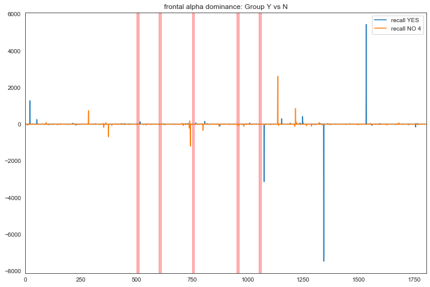


```python
df=pd.DataFrame()
df['Frontal Dominance'] = (y.fp_asymmetry[:500].mean(),y.fp_asymmetry[500:600].mean(),y.fp_asymmetry[600:750].mean(),y.fp_asymmetry[750:950].mean(),y.fp_asymmetry[950:1050].mean(),y.fp_asymmetry[1050:].mean())
df['scene'] =('before the on set','on set', 'out of track','fence hit','2s after','3s after~')
df['recall']=('Y')

dfn=pd.DataFrame()
dfn['Frontal Dominance']= (n4.fp_asymmetry[:500].mean(),n4.fp_asymmetry[500:600].mean(),n4.fp_asymmetry[600:750].mean(),n4.fp_asymmetry[750:950].mean(),n4.fp_asymmetry[950:1050].mean(),n4.fp_asymmetry[1050:].mean())
dfn['scene'] =('before the on set','on set', 'out of track','fence hit','2s after','3s after~')
dfn['recall']=('N')

a=pd.concat([df,dfn])
```


```python
sns.set(style="whitegrid",font_scale=1.5)
ax = sns.barplot(x="scene", y='Frontal Dominance',hue="recall", data=a)
plt.gcf().set_size_inches(12,8)
```


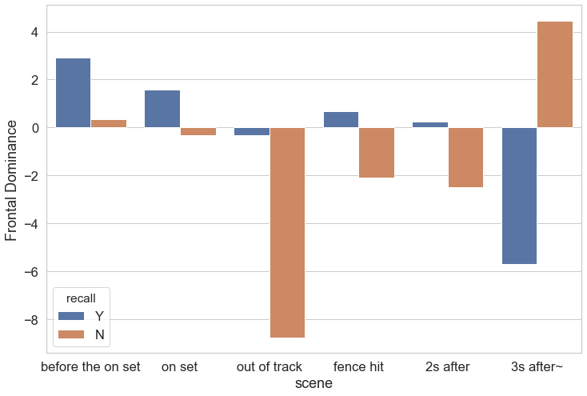


```python
sns.set(style="white",font_scale=1.5)
ax = sns.lineplot(x="scene", y='Frontal Dominance',hue="recall", data=a,sort=False)
plt.gcf().set_size_inches(12,8)
```


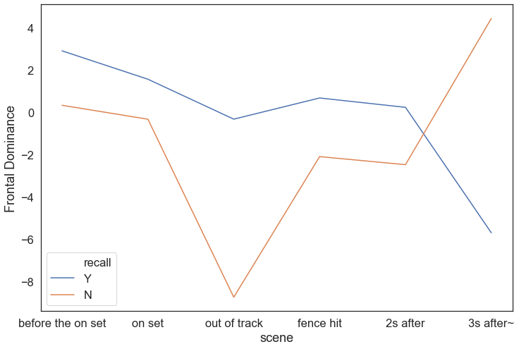


## 6 Occ. Dominance


```python

result = pd.DataFrame({
                      'recall YES': y.occ_asymmetry,
                       #'recall NO 1': ns1,
                      #  'recall NO 2': ns2,
                      #  'recall NO 3': ns3,
                        'recall NO 4': n4.occ_asymmetry,
                        #'recall NO 5': ns5,
})

sns.set_style("white")
result.plot(title="occipital alpha dominance: Group Y vs N")

plt.axvspan(500, 510, color='red', alpha=0.3)
plt.axvspan(600, 610, color='red', alpha=0.3)
plt.axvspan(750, 760, color='red', alpha=0.3)
plt.axvspan(950, 960, color='red', alpha=0.3)
plt.axvspan(1050, 1060, color='red', alpha=0.3)

plt.gcf().set_size_inches(12,8)
```


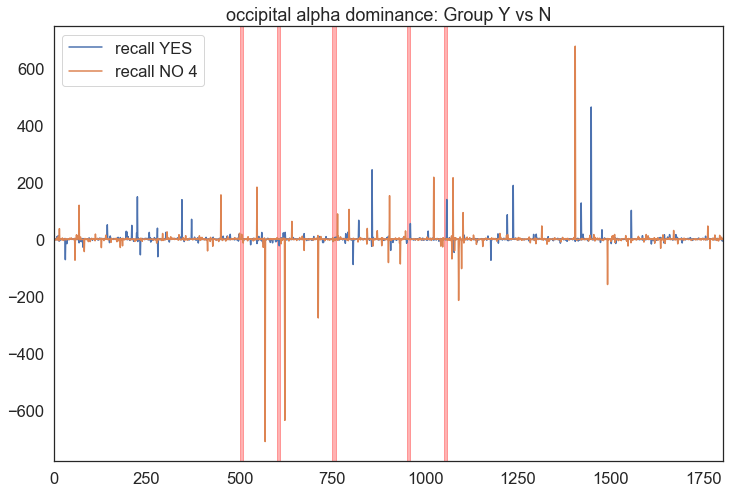


```python
df=pd.DataFrame()
df['Occ Dominance'] = (y.occ_asymmetry[:500].mean(),y.occ_asymmetry[500:600].mean(),y.occ_asymmetry[600:750].mean(),y.occ_asymmetry[750:950].mean(),y.occ_asymmetry[950:1050].mean(),y.occ_asymmetry[1050:].mean())
df['scene'] =('before the on set','on set', 'out of track','fence hit','2s after','3s after~')
df['recall']=('Y')

dfn=pd.DataFrame()
dfn['Occ Dominance']= (n4.occ_asymmetry[:500].mean(),n4.occ_asymmetry[500:600].mean(),n4.occ_asymmetry[600:750].mean(),n4.occ_asymmetry[750:950].mean(),n4.occ_asymmetry[950:1050].mean(),n4.occ_asymmetry[1050:].mean())
dfn['scene'] =('before the on set','on set', 'out of track','fence hit','2s after','3s after~')
dfn['recall']=('N')

a=pd.concat([df,dfn])
```


```python
sns.set(style="whitegrid",font_scale=1.5)
ax = sns.barplot(x="scene", y="Occ Dominance",hue="recall", data=a)
plt.gcf().set_size_inches(12,8)
```


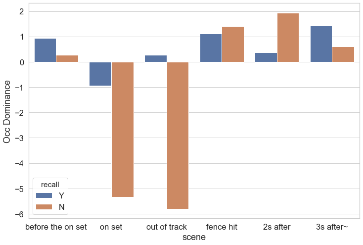


```python
sns.set(style="whitegrid",font_scale=1.5)
ax = sns.lineplot(x="scene", y='Occ Dominance',hue="recall", data=a,sort=False)
plt.gcf().set_size_inches(12,8)
```


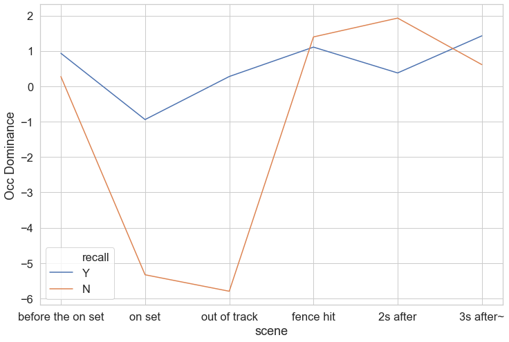


## END.
