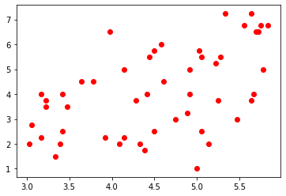

```python
import pandas as pd 
import numpy as np 
from scipy import stats
import glob
```


```python
a=pd.read_excel('분석용설문데이터.xlsx')
```


```python
a.head()
```


<div>
<style scoped>
    .dataframe tbody tr th:only-of-type {
        vertical-align: middle;
    }

    .dataframe tbody tr th {
        vertical-align: top;
    }

    .dataframe thead th {
        text-align: right;
    }
</style>
<table border="1" class="dataframe">
  <thead>
    <tr style="text-align: right;">
      <th></th>
      <th>Subject</th>
      <th>Cond</th>
      <th>MidAdViewingTime</th>
      <th>YT</th>
      <th>YT2</th>
      <th>P_Scene_Recog</th>
      <th>P_Phrase_Recog</th>
      <th>P_Approach</th>
      <th>P_Attitude</th>
      <th>P_Brand</th>
      <th>...</th>
      <th>M_DA</th>
      <th>M_Experience11</th>
      <th>Freq</th>
      <th>Amount</th>
      <th>subject</th>
      <th>Device</th>
      <th>Purpose</th>
      <th>gender</th>
      <th>age</th>
      <th>education</th>
    </tr>
  </thead>
  <tbody>
    <tr>
      <th>0</th>
      <td>101</td>
      <td>0</td>
      <td>8.223</td>
      <td>5.333333</td>
      <td>1</td>
      <td>6.153846</td>
      <td>4.888889</td>
      <td>7.50</td>
      <td>6.333333</td>
      <td>6.000000</td>
      <td>...</td>
      <td>6.000000</td>
      <td>9</td>
      <td>3</td>
      <td>2</td>
      <td>5</td>
      <td>1</td>
      <td>2</td>
      <td>1</td>
      <td>20.0</td>
      <td>1.0</td>
    </tr>
    <tr>
      <th>1</th>
      <td>102</td>
      <td>1</td>
      <td>12.764</td>
      <td>4.666667</td>
      <td>1</td>
      <td>6.615385</td>
      <td>4.555556</td>
      <td>7.50</td>
      <td>7.333333</td>
      <td>6.666667</td>
      <td>...</td>
      <td>4.666667</td>
      <td>2</td>
      <td>5</td>
      <td>3</td>
      <td>4</td>
      <td>1</td>
      <td>1</td>
      <td>2</td>
      <td>20.0</td>
      <td>1.0</td>
    </tr>
    <tr>
      <th>2</th>
      <td>103</td>
      <td>0</td>
      <td>8.017</td>
      <td>4.666667</td>
      <td>1</td>
      <td>7.153846</td>
      <td>5.555556</td>
      <td>7.00</td>
      <td>6.333333</td>
      <td>6.666667</td>
      <td>...</td>
      <td>4.666667</td>
      <td>3</td>
      <td>7</td>
      <td>4</td>
      <td>5</td>
      <td>1</td>
      <td>1</td>
      <td>1</td>
      <td>20.0</td>
      <td>1.0</td>
    </tr>
    <tr>
      <th>3</th>
      <td>104</td>
      <td>1</td>
      <td>13.771</td>
      <td>7.666667</td>
      <td>1</td>
      <td>6.153846</td>
      <td>5.611111</td>
      <td>7.25</td>
      <td>6.333333</td>
      <td>4.000000</td>
      <td>...</td>
      <td>6.000000</td>
      <td>6</td>
      <td>7</td>
      <td>2</td>
      <td>2</td>
      <td>4</td>
      <td>4</td>
      <td>2</td>
      <td>23.0</td>
      <td>1.0</td>
    </tr>
    <tr>
      <th>4</th>
      <td>105</td>
      <td>0</td>
      <td>8.379</td>
      <td>6.666667</td>
      <td>1</td>
      <td>7.230769</td>
      <td>4.500000</td>
      <td>2.50</td>
      <td>7.000000</td>
      <td>5.000000</td>
      <td>...</td>
      <td>5.666667</td>
      <td>9</td>
      <td>7</td>
      <td>4</td>
      <td>1</td>
      <td>1</td>
      <td>1</td>
      <td>2</td>
      <td>22.0</td>
      <td>1.0</td>
    </tr>
  </tbody>
</table>
<p>5 rows × 30 columns</p>
</div>


```python
import statsmodels.api as sm
import statsmodels.formula.api as smf
```


```python
a.columns
```


    Index(['Subject', 'Cond', 'MidAdViewingTime', 'YT', 'YT2', 'P_Scene_Recog',
           'P_Phrase_Recog', 'P_Approach', 'P_Attitude', 'P_Brand', 'P_Cong',
           'P_Experience8', 'M_Scene_Recog', 'M_Phrase_Recog', 'M_Approach',
           'M_Attitude', 'M_Model', 'M_Cong', 'M_DI', 'M_Unicef', 'M_DA',
           'M_Experience11', 'Freq', 'Amount', 'subject', 'Device', 'Purpose',
           'gender', 'age', 'education'],
          dtype='object')


```python
a['Approach X Cond']=a['M_Approach']*a['Cond']
```


```python
x=np.array(a[['M_Approach','Cond','Approach X Cond']])
```


```python
y=np.array(a[['M_Scene_Recog']])
```


```python
x= sm.add_constant(x)
ols_resid = sm.OLS(y, x).fit().resid
res_fit = sm.OLS(ols_resid[1:], ols_resid[:-1]).fit()
rho = res_fit.params
```


```python
from scipy.linalg import toeplitz
order = toeplitz(np.arange(len(y)))
sigma = rho**order
```


```python
gls_model = sm.GLS(y, x, sigma=sigma)
gls_results = gls_model.fit()
print(gls_results.summary())
```

                                GLS Regression Results                            
    ==============================================================================
    Dep. Variable:                      y   R-squared:                       0.306
    Model:                            GLS   Adj. R-squared:                  0.261
    Method:                 Least Squares   F-statistic:                     6.760
    Date:                Fri, 01 Nov 2019   Prob (F-statistic):           0.000714
    Time:                        11:14:51   Log-Likelihood:                -58.420
    No. Observations:                  50   AIC:                             124.8
    Df Residuals:                      46   BIC:                             132.5
    Df Model:                           3                                         
    Covariance Type:            nonrobust                                         
    ==============================================================================
                     coef    std err          t      P>|t|      [0.025      0.975]
    ------------------------------------------------------------------------------
    const          4.5127      0.350     12.902      0.000       3.809       5.217
    x1            -0.0035      0.044     -0.079      0.937      -0.093       0.086
    x2            -1.6415      0.521     -3.149      0.003      -2.691      -0.592
    x3             0.4229      0.111      3.794      0.000       0.199       0.647
    ==============================================================================
    Omnibus:                        4.843   Durbin-Watson:                   2.023
    Prob(Omnibus):                  0.089   Jarque-Bera (JB):                2.087
    Skew:                          -0.123   Prob(JB):                        0.352
    Kurtosis:                       2.030   Cond. No.                         43.4
    ==============================================================================
    
    Warnings:
    [1] Standard Errors assume that the covariance matrix of the errors is correctly specified.


```python
ols_model = sm.OLS(y, x)
ols_results = ols_model.fit()
print(ols_results.summary())
```

                                OLS Regression Results                            
    ==============================================================================
    Dep. Variable:                      y   R-squared:                       0.302
    Model:                            OLS   Adj. R-squared:                  0.257
    Method:                 Least Squares   F-statistic:                     6.646
    Date:                Fri, 01 Nov 2019   Prob (F-statistic):           0.000800
    Time:                        11:14:52   Log-Likelihood:                -58.529
    No. Observations:                  50   AIC:                             125.1
    Df Residuals:                      46   BIC:                             132.7
    Df Model:                           3                                         
    Covariance Type:            nonrobust                                         
    ==============================================================================
                     coef    std err          t      P>|t|      [0.025      0.975]
    ------------------------------------------------------------------------------
    const          4.5211      0.353     12.809      0.000       3.811       5.232
    x1            -0.0046      0.045     -0.103      0.919      -0.095       0.086
    x2            -1.6412      0.520     -3.158      0.003      -2.687      -0.595
    x3             0.4226      0.113      3.737      0.001       0.195       0.650
    ==============================================================================
    Omnibus:                        3.885   Durbin-Watson:                   2.129
    Prob(Omnibus):                  0.143   Jarque-Bera (JB):                1.811
    Skew:                          -0.068   Prob(JB):                        0.404
    Kurtosis:                       2.078   Cond. No.                         41.0
    ==============================================================================
    
    Warnings:
    [1] Standard Errors assume that the covariance matrix of the errors is correctly specified.


### Approach <-Cong


```python

a['interaction1']=a['M_Attitude']*a['Cond']
a['interaction2']=a['M_Approach']*a['Cond']
a['interaction3']=a['M_Cong']*a['Cond']
a['recog']=(a['M_Phrase_Recog']+a['M_Scene_Recog'])/2
#x=np.array(a[['M_Attitude','Cond','interaction1']])
x=np.array(a[['M_Cong']])
y=np.array(a['M_Approach'])

x= sm.add_constant(x)
ols_resid = sm.OLS(y, x).fit().resid
res_fit = sm.OLS(ols_resid[1:], ols_resid[:-1]).fit()
rho = res_fit.params

from scipy.linalg import toeplitz
order = toeplitz(np.arange(len(y)))
sigma = rho**order

gls_model = sm.GLS(y, x, sigma=sigma)
gls_results = gls_model.fit()
print(gls_results.summary())

ols_model = sm.OLS(y, x)
ols_results = ols_model.fit()
print(ols_results.summary())
```

                                GLS Regression Results                            
    ==============================================================================
    Dep. Variable:                      y   R-squared:                       0.316
    Model:                            GLS   Adj. R-squared:                  0.302
    Method:                 Least Squares   F-statistic:                     22.18
    Date:                Fri, 01 Nov 2019   Prob (F-statistic):           2.15e-05
    Time:                        11:37:03   Log-Likelihood:                -88.317
    No. Observations:                  50   AIC:                             180.6
    Df Residuals:                      48   BIC:                             184.5
    Df Model:                           1                                         
    Covariance Type:            nonrobust                                         
    ==============================================================================
                     coef    std err          t      P>|t|      [0.025      0.975]
    ------------------------------------------------------------------------------
    const          1.2369      0.623      1.986      0.053      -0.015       2.489
    x1             0.4190      0.089      4.709      0.000       0.240       0.598
    ==============================================================================
    Omnibus:                        2.507   Durbin-Watson:                   1.963
    Prob(Omnibus):                  0.285   Jarque-Bera (JB):                2.380
    Skew:                           0.473   Prob(JB):                        0.304
    Kurtosis:                       2.504   Cond. No.                         30.4
    ==============================================================================
    
    Warnings:
    [1] Standard Errors assume that the covariance matrix of the errors is correctly specified.
                                OLS Regression Results                            
    ==============================================================================
    Dep. Variable:                      y   R-squared:                       0.180
    Model:                            OLS   Adj. R-squared:                  0.163
    Method:                 Least Squares   F-statistic:                     10.57
    Date:                Fri, 01 Nov 2019   Prob (F-statistic):            0.00211
    Time:                        11:37:03   Log-Likelihood:                -92.672
    No. Observations:                  50   AIC:                             189.3
    Df Residuals:                      48   BIC:                             193.2
    Df Model:                           1                                         
    Covariance Type:            nonrobust                                         
    ==============================================================================
                     coef    std err          t      P>|t|      [0.025      0.975]
    ------------------------------------------------------------------------------
    const          1.6841      0.773      2.179      0.034       0.130       3.238
    x1             0.3543      0.109      3.251      0.002       0.135       0.573
    ==============================================================================
    Omnibus:                        2.232   Durbin-Watson:                   2.606
    Prob(Omnibus):                  0.328   Jarque-Bera (JB):                1.496
    Skew:                           0.178   Prob(JB):                        0.473
    Kurtosis:                       2.231   Cond. No.                         25.0
    ==============================================================================
    
    Warnings:
    [1] Standard Errors assume that the covariance matrix of the errors is correctly specified.


### Attitude <- Cong


```python

a['interaction1']=a['M_Attitude']*a['Cond']
a['interaction2']=a['M_Approach']*a['Cond']
a['interaction3']=a['M_Cong']*a['Cond']
a['recog']=(a['M_Phrase_Recog']+a['M_Scene_Recog'])/2
#x=np.array(a[['M_Attitude','Cond','interaction1']])
x=np.array(a[['M_Cong']])
y=np.array(a['M_Attitude'])

x= sm.add_constant(x)
ols_resid = sm.OLS(y, x).fit().resid
res_fit = sm.OLS(ols_resid[1:], ols_resid[:-1]).fit()
rho = res_fit.params

from scipy.linalg import toeplitz
order = toeplitz(np.arange(len(y)))
sigma = rho**order

gls_model = sm.GLS(y, x, sigma=sigma)
gls_results = gls_model.fit()
print(gls_results.summary())

ols_model = sm.OLS(y, x)
ols_results = ols_model.fit()
print(ols_results.summary())
```

                                GLS Regression Results                            
    ==============================================================================
    Dep. Variable:                      y   R-squared:                       0.218
    Model:                            GLS   Adj. R-squared:                  0.202
    Method:                 Least Squares   F-statistic:                     13.41
    Date:                Fri, 01 Nov 2019   Prob (F-statistic):           0.000624
    Time:                        11:58:13   Log-Likelihood:                -121.70
    No. Observations:                  50   AIC:                             247.4
    Df Residuals:                      48   BIC:                             251.2
    Df Model:                           1                                         
    Covariance Type:            nonrobust                                         
    ==============================================================================
                     coef    std err          t      P>|t|      [0.025      0.975]
    ------------------------------------------------------------------------------
    const          2.4217      1.319      1.836      0.073      -0.230       5.074
    x1             0.6868      0.188      3.662      0.001       0.310       1.064
    ==============================================================================
    Omnibus:                        1.589   Durbin-Watson:                   1.939
    Prob(Omnibus):                  0.452   Jarque-Bera (JB):                1.119
    Skew:                           0.001   Prob(JB):                        0.571
    Kurtosis:                       2.267   Cond. No.                         28.0
    ==============================================================================
    
    Warnings:
    [1] Standard Errors assume that the covariance matrix of the errors is correctly specified.
                                OLS Regression Results                            
    ==============================================================================
    Dep. Variable:                      y   R-squared:                       0.174
    Model:                            OLS   Adj. R-squared:                  0.157
    Method:                 Least Squares   F-statistic:                     10.14
    Date:                Fri, 01 Nov 2019   Prob (F-statistic):            0.00254
    Time:                        11:58:13   Log-Likelihood:                -122.56
    No. Observations:                  50   AIC:                             249.1
    Df Residuals:                      48   BIC:                             252.9
    Df Model:                           1                                         
    Covariance Type:            nonrobust                                         
    ==============================================================================
                     coef    std err          t      P>|t|      [0.025      0.975]
    ------------------------------------------------------------------------------
    const          2.8043      1.405      1.996      0.052      -0.021       5.630
    x1             0.6312      0.198      3.185      0.003       0.233       1.030
    ==============================================================================
    Omnibus:                        3.272   Durbin-Watson:                   2.220
    Prob(Omnibus):                  0.195   Jarque-Bera (JB):                1.635
    Skew:                           0.013   Prob(JB):                        0.442
    Kurtosis:                       2.115   Cond. No.                         25.0
    ==============================================================================
    
    Warnings:
    [1] Standard Errors assume that the covariance matrix of the errors is correctly specified.


```python

a['interaction1']=a['M_Attitude']*a['Cond']
a['interaction2']=a['M_Approach']*a['Cond']
a['interaction3']=a['M_Cong']*a['Cond']
a['recog']=(a['M_Phrase_Recog']+a['M_Scene_Recog'])/2
#x=np.array(a[['M_Attitude','Cond','interaction1']])
x=np.array(a[['M_Cong']])
y=np.array(a['M_Attitude'])

x= sm.add_constant(x)
ols_resid = sm.OLS(y, x).fit().resid
res_fit = sm.OLS(ols_resid[1:], ols_resid[:-1]).fit()
rho = res_fit.params

from scipy.linalg import toeplitz
order = toeplitz(np.arange(len(y)))
sigma = rho**order

gls_model = sm.GLS(y, x, sigma=sigma)
gls_results = gls_model.fit()
print(gls_results.summary())

ols_model = sm.OLS(y, x)
ols_results = ols_model.fit()
print(ols_results.summary())
```

                                GLS Regression Results                            
    ==============================================================================
    Dep. Variable:                      y   R-squared:                       0.218
    Model:                            GLS   Adj. R-squared:                  0.202
    Method:                 Least Squares   F-statistic:                     13.41
    Date:                Fri, 01 Nov 2019   Prob (F-statistic):           0.000624
    Time:                        11:58:13   Log-Likelihood:                -121.70
    No. Observations:                  50   AIC:                             247.4
    Df Residuals:                      48   BIC:                             251.2
    Df Model:                           1                                         
    Covariance Type:            nonrobust                                         
    ==============================================================================
                     coef    std err          t      P>|t|      [0.025      0.975]
    ------------------------------------------------------------------------------
    const          2.4217      1.319      1.836      0.073      -0.230       5.074
    x1             0.6868      0.188      3.662      0.001       0.310       1.064
    ==============================================================================
    Omnibus:                        1.589   Durbin-Watson:                   1.939
    Prob(Omnibus):                  0.452   Jarque-Bera (JB):                1.119
    Skew:                           0.001   Prob(JB):                        0.571
    Kurtosis:                       2.267   Cond. No.                         28.0
    ==============================================================================
    
    Warnings:
    [1] Standard Errors assume that the covariance matrix of the errors is correctly specified.
                                OLS Regression Results                            
    ==============================================================================
    Dep. Variable:                      y   R-squared:                       0.174
    Model:                            OLS   Adj. R-squared:                  0.157
    Method:                 Least Squares   F-statistic:                     10.14
    Date:                Fri, 01 Nov 2019   Prob (F-statistic):            0.00254
    Time:                        11:58:13   Log-Likelihood:                -122.56
    No. Observations:                  50   AIC:                             249.1
    Df Residuals:                      48   BIC:                             252.9
    Df Model:                           1                                         
    Covariance Type:            nonrobust                                         
    ==============================================================================
                     coef    std err          t      P>|t|      [0.025      0.975]
    ------------------------------------------------------------------------------
    const          2.8043      1.405      1.996      0.052      -0.021       5.630
    x1             0.6312      0.198      3.185      0.003       0.233       1.030
    ==============================================================================
    Omnibus:                        3.272   Durbin-Watson:                   2.220
    Prob(Omnibus):                  0.195   Jarque-Bera (JB):                1.635
    Skew:                           0.013   Prob(JB):                        0.442
    Kurtosis:                       2.115   Cond. No.                         25.0
    ==============================================================================
    
    Warnings:
    [1] Standard Errors assume that the covariance matrix of the errors is correctly specified.


### MidAdViewingTime <-Cong


```python

a['interaction1']=a['M_Attitude']*a['Cond']
a['interaction2']=a['M_Approach']*a['Cond']
a['interaction3']=a['M_Cong']*a['Cond']
a['recog']=(a['M_Phrase_Recog']+a['M_Scene_Recog'])/2
#x=np.array(a[['M_Attitude','Cond','interaction1']])
x=np.array(a[['M_Approach','Cond','interaction2']])
y=np.array(a['recog'])

x= sm.add_constant(x)
ols_resid = sm.OLS(y, x).fit().resid
res_fit = sm.OLS(ols_resid[1:], ols_resid[:-1]).fit()
rho = res_fit.params

from scipy.linalg import toeplitz
order = toeplitz(np.arange(len(y)))
sigma = rho**order

gls_model = sm.GLS(y, x, sigma=sigma)
gls_results = gls_model.fit()
print(gls_results.summary())

ols_model = sm.OLS(y, x)
ols_results = ols_model.fit()
print(ols_results.summary())
```

                                GLS Regression Results                            
    ==============================================================================
    Dep. Variable:                      y   R-squared:                       0.351
    Model:                            GLS   Adj. R-squared:                  0.308
    Method:                 Least Squares   F-statistic:                     8.275
    Date:                Fri, 01 Nov 2019   Prob (F-statistic):           0.000165
    Time:                        14:25:37   Log-Likelihood:                -53.223
    No. Observations:                  50   AIC:                             114.4
    Df Residuals:                      46   BIC:                             122.1
    Df Model:                           3                                         
    Covariance Type:            nonrobust                                         
    ==============================================================================
                     coef    std err          t      P>|t|      [0.025      0.975]
    ------------------------------------------------------------------------------
    const          3.9544      0.379     10.420      0.000       3.191       4.718
    x1             0.1221      0.087      1.400      0.168      -0.053       0.298
    x2            -1.0225      0.538     -1.902      0.063      -2.105       0.060
    x3             0.2786      0.120      2.321      0.025       0.037       0.520
    ==============================================================================
    Omnibus:                        2.138   Durbin-Watson:                   2.021
    Prob(Omnibus):                  0.343   Jarque-Bera (JB):                1.427
    Skew:                          -0.155   Prob(JB):                        0.490
    Kurtosis:                       2.233   Cond. No.                         33.1
    ==============================================================================
    
    Warnings:
    [1] Standard Errors assume that the covariance matrix of the errors is correctly specified.
                                OLS Regression Results                            
    ==============================================================================
    Dep. Variable:                      y   R-squared:                       0.348
    Model:                            OLS   Adj. R-squared:                  0.306
    Method:                 Least Squares   F-statistic:                     8.189
    Date:                Fri, 01 Nov 2019   Prob (F-statistic):           0.000179
    Time:                        14:25:37   Log-Likelihood:                -53.314
    No. Observations:                  50   AIC:                             114.6
    Df Residuals:                      46   BIC:                             122.3
    Df Model:                           3                                         
    Covariance Type:            nonrobust                                         
    ==============================================================================
                     coef    std err          t      P>|t|      [0.025      0.975]
    ------------------------------------------------------------------------------
    const          3.9786      0.380     10.459      0.000       3.213       4.744
    x1             0.1162      0.088      1.327      0.191      -0.060       0.292
    x2            -1.0373      0.539     -1.925      0.060      -2.122       0.048
    x3             0.2824      0.122      2.320      0.025       0.037       0.527
    ==============================================================================
    Omnibus:                        1.901   Durbin-Watson:                   2.118
    Prob(Omnibus):                  0.387   Jarque-Bera (JB):                1.294
    Skew:                          -0.116   Prob(JB):                        0.524
    Kurtosis:                       2.247   Cond. No.                         31.7
    ==============================================================================
    
    Warnings:
    [1] Standard Errors assume that the covariance matrix of the errors is correctly specified.


### Recog<-MidAdViewingTime<-Attitude<-Cong? Recog<-Attitude<-MidAdViewingTime<-Cong  


```python

a['interaction1']=a['M_Attitude']*a['Cond']
a['interaction2']=a['M_Approach']*a['Cond']
a['interaction3']=a['M_Cong']*a['Cond']
a['recog']=(a['M_Phrase_Recog']+a['M_Scene_Recog'])/2
#x=np.array(a[['M_Attitude','Cond','interaction1']])
x=np.array(a[['M_Cong']])
y=np.array(a['M_Attitude'])

x= sm.add_constant(x)
ols_resid = sm.OLS(y, x).fit().resid
res_fit = sm.OLS(ols_resid[1:], ols_resid[:-1]).fit()
rho = res_fit.params

from scipy.linalg import toeplitz
order = toeplitz(np.arange(len(y)))
sigma = rho**order

gls_model = sm.GLS(y, x, sigma=sigma)
gls_results = gls_model.fit()
print(gls_results.summary())

ols_model = sm.OLS(y, x)
ols_results = ols_model.fit()
print(ols_results.summary())
```


```python

a['interaction1']=a['M_Attitude']*a['Cond']
a['interaction2']=a['M_Approach']*a['Cond']
a['interaction3']=a['M_Cong']*a['Cond']
a['recog']=(a['M_Phrase_Recog']+a['M_Scene_Recog'])/2
#x=np.array(a[['M_Attitude','Cond','interaction1']])
x=np.array(a[['M_Cong']])
y=np.array(a['M_Attitude'])

x= sm.add_constant(x)
ols_resid = sm.OLS(y, x).fit().resid
res_fit = sm.OLS(ols_resid[1:], ols_resid[:-1]).fit()
rho = res_fit.params

from scipy.linalg import toeplitz
order = toeplitz(np.arange(len(y)))
sigma = rho**order

gls_model = sm.GLS(y, x, sigma=sigma)
gls_results = gls_model.fit()
print(gls_results.summary())

ols_model = sm.OLS(y, x)
ols_results = ols_model.fit()
print(ols_results.summary())
```

                                GLS Regression Results                            
    ==============================================================================
    Dep. Variable:                      y   R-squared:                       0.218
    Model:                            GLS   Adj. R-squared:                  0.202
    Method:                 Least Squares   F-statistic:                     13.41
    Date:                Fri, 01 Nov 2019   Prob (F-statistic):           0.000624
    Time:                        12:09:39   Log-Likelihood:                -121.70
    No. Observations:                  50   AIC:                             247.4
    Df Residuals:                      48   BIC:                             251.2
    Df Model:                           1                                         
    Covariance Type:            nonrobust                                         
    ==============================================================================
                     coef    std err          t      P>|t|      [0.025      0.975]
    ------------------------------------------------------------------------------
    const          2.4217      1.319      1.836      0.073      -0.230       5.074
    x1             0.6868      0.188      3.662      0.001       0.310       1.064
    ==============================================================================
    Omnibus:                        1.589   Durbin-Watson:                   1.939
    Prob(Omnibus):                  0.452   Jarque-Bera (JB):                1.119
    Skew:                           0.001   Prob(JB):                        0.571
    Kurtosis:                       2.267   Cond. No.                         28.0
    ==============================================================================
    
    Warnings:
    [1] Standard Errors assume that the covariance matrix of the errors is correctly specified.
                                OLS Regression Results                            
    ==============================================================================
    Dep. Variable:                      y   R-squared:                       0.174
    Model:                            OLS   Adj. R-squared:                  0.157
    Method:                 Least Squares   F-statistic:                     10.14
    Date:                Fri, 01 Nov 2019   Prob (F-statistic):            0.00254
    Time:                        12:09:39   Log-Likelihood:                -122.56
    No. Observations:                  50   AIC:                             249.1
    Df Residuals:                      48   BIC:                             252.9
    Df Model:                           1                                         
    Covariance Type:            nonrobust                                         
    ==============================================================================
                     coef    std err          t      P>|t|      [0.025      0.975]
    ------------------------------------------------------------------------------
    const          2.8043      1.405      1.996      0.052      -0.021       5.630
    x1             0.6312      0.198      3.185      0.003       0.233       1.030
    ==============================================================================
    Omnibus:                        3.272   Durbin-Watson:                   2.220
    Prob(Omnibus):                  0.195   Jarque-Bera (JB):                1.635
    Skew:                           0.013   Prob(JB):                        0.442
    Kurtosis:                       2.115   Cond. No.                         25.0
    ==============================================================================
    
    Warnings:
    [1] Standard Errors assume that the covariance matrix of the errors is correctly specified.


```python

a['interaction1']=a['M_Attitude']*a['Cond']
a['interaction2']=a['M_Approach']*a['Cond']
a['interaction3']=a['M_Cong']*a['Cond']
a['recog']=(a['M_Phrase_Recog']+a['M_Scene_Recog'])/2
#x=np.array(a[['M_Attitude','Cond','interaction1']])
x=np.array(a[['M_Attitude']])
y=np.array(a['MidAdViewingTime'])

x= sm.add_constant(x)
ols_resid = sm.OLS(y, x).fit().resid
res_fit = sm.OLS(ols_resid[1:], ols_resid[:-1]).fit()
rho = res_fit.params

from scipy.linalg import toeplitz
order = toeplitz(np.arange(len(y)))
sigma = rho**order

gls_model = sm.GLS(y, x, sigma=sigma)
gls_results = gls_model.fit()
print(gls_results.summary())

ols_model = sm.OLS(y, x)
ols_results = ols_model.fit()
print(ols_results.summary())
```

                                GLS Regression Results                            
    ==============================================================================
    Dep. Variable:                      y   R-squared:                       0.125
    Model:                            GLS   Adj. R-squared:                  0.107
    Method:                 Least Squares   F-statistic:                     6.848
    Date:                Fri, 01 Nov 2019   Prob (F-statistic):             0.0118
    Time:                        12:08:19   Log-Likelihood:                -182.72
    No. Observations:                  50   AIC:                             369.4
    Df Residuals:                      48   BIC:                             373.3
    Df Model:                           1                                         
    Covariance Type:            nonrobust                                         
    ==============================================================================
                     coef    std err          t      P>|t|      [0.025      0.975]
    ------------------------------------------------------------------------------
    const          6.4421      3.378      1.907      0.062      -0.349      13.233
    x1             1.1431      0.437      2.617      0.012       0.265       2.021
    ==============================================================================
    Omnibus:                       11.439   Durbin-Watson:                   1.957
    Prob(Omnibus):                  0.003   Jarque-Bera (JB):               11.464
    Skew:                           1.115   Prob(JB):                      0.00324
    Kurtosis:                       3.725   Cond. No.                         19.7
    ==============================================================================
    
    Warnings:
    [1] Standard Errors assume that the covariance matrix of the errors is correctly specified.
                                OLS Regression Results                            
    ==============================================================================
    Dep. Variable:                      y   R-squared:                       0.125
    Model:                            OLS   Adj. R-squared:                  0.107
    Method:                 Least Squares   F-statistic:                     6.865
    Date:                Fri, 01 Nov 2019   Prob (F-statistic):             0.0117
    Time:                        12:08:19   Log-Likelihood:                -182.72
    No. Observations:                  50   AIC:                             369.4
    Df Residuals:                      48   BIC:                             373.3
    Df Model:                           1                                         
    Covariance Type:            nonrobust                                         
    ==============================================================================
                     coef    std err          t      P>|t|      [0.025      0.975]
    ------------------------------------------------------------------------------
    const          6.4328      3.378      1.904      0.063      -0.359      13.225
    x1             1.1445      0.437      2.620      0.012       0.266       2.023
    ==============================================================================
    Omnibus:                       11.448   Durbin-Watson:                   1.959
    Prob(Omnibus):                  0.003   Jarque-Bera (JB):               11.475
    Skew:                           1.116   Prob(JB):                      0.00322
    Kurtosis:                       3.727   Cond. No.                         19.6
    ==============================================================================
    
    Warnings:
    [1] Standard Errors assume that the covariance matrix of the errors is correctly specified.


```python

a['interaction1']=a['M_Attitude']*a['Cond']
a['interaction2']=a['M_Approach']*a['Cond']
a['interaction3']=a['M_Cong']*a['Cond']
a['recog']=(a['M_Phrase_Recog']+a['M_Scene_Recog'])/2
#x=np.array(a[['M_Attitude','Cond','interaction1']])
x=np.array(a[['MidAdViewingTime']])
y=np.array(a['recog'])

x= sm.add_constant(x)
ols_resid = sm.OLS(y, x).fit().resid
res_fit = sm.OLS(ols_resid[1:], ols_resid[:-1]).fit()
rho = res_fit.params

from scipy.linalg import toeplitz
order = toeplitz(np.arange(len(y)))
sigma = rho**order

gls_model = sm.GLS(y, x, sigma=sigma)
gls_results = gls_model.fit()
print(gls_results.summary())

ols_model = sm.OLS(y, x)
ols_results = ols_model.fit()
print(ols_results.summary())
```

                                GLS Regression Results                            
    ==============================================================================
    Dep. Variable:                      y   R-squared:                       0.443
    Model:                            GLS   Adj. R-squared:                  0.432
    Method:                 Least Squares   F-statistic:                     38.21
    Date:                Fri, 01 Nov 2019   Prob (F-statistic):           1.32e-07
    Time:                        12:10:10   Log-Likelihood:                -49.433
    No. Observations:                  50   AIC:                             102.9
    Df Residuals:                      48   BIC:                             106.7
    Df Model:                           1                                         
    Covariance Type:            nonrobust                                         
    ==============================================================================
                     coef    std err          t      P>|t|      [0.025      0.975]
    ------------------------------------------------------------------------------
    const          3.6827      0.167     22.064      0.000       3.347       4.018
    x1             0.0578      0.009      6.181      0.000       0.039       0.077
    ==============================================================================
    Omnibus:                        7.190   Durbin-Watson:                   1.987
    Prob(Omnibus):                  0.027   Jarque-Bera (JB):                2.475
    Skew:                           0.099   Prob(JB):                        0.290
    Kurtosis:                       1.928   Cond. No.                         30.9
    ==============================================================================
    
    Warnings:
    [1] Standard Errors assume that the covariance matrix of the errors is correctly specified.
                                OLS Regression Results                            
    ==============================================================================
    Dep. Variable:                      y   R-squared:                       0.441
    Model:                            OLS   Adj. R-squared:                  0.430
    Method:                 Least Squares   F-statistic:                     37.94
    Date:                Fri, 01 Nov 2019   Prob (F-statistic):           1.43e-07
    Time:                        12:10:10   Log-Likelihood:                -49.452
    No. Observations:                  50   AIC:                             102.9
    Df Residuals:                      48   BIC:                             106.7
    Df Model:                           1                                         
    Covariance Type:            nonrobust                                         
    ==============================================================================
                     coef    std err          t      P>|t|      [0.025      0.975]
    ------------------------------------------------------------------------------
    const          3.6823      0.166     22.209      0.000       3.349       4.016
    x1             0.0579      0.009      6.159      0.000       0.039       0.077
    ==============================================================================
    Omnibus:                        7.543   Durbin-Watson:                   1.941
    Prob(Omnibus):                  0.023   Jarque-Bera (JB):                2.532
    Skew:                           0.100   Prob(JB):                        0.282
    Kurtosis:                       1.916   Cond. No.                         31.2
    ==============================================================================
    
    Warnings:
    [1] Standard Errors assume that the covariance matrix of the errors is correctly specified.


### Recog<-Approach+Cond+Approach*Cond


```python
a['interaction1']=a['M_Attitude']*a['Cond']
a['interaction2']=a['M_Approach']*a['Cond']
a['recog']=(a['M_Phrase_Recog']+a['M_Scene_Recog'])/2
x=np.array(a[['M_Approach','Cond','interaction2']])
y=np.array(a['recog'])

x= sm.add_constant(x)
ols_resid = sm.OLS(y, x).fit().resid
res_fit = sm.OLS(ols_resid[1:], ols_resid[:-1]).fit()
rho = res_fit.params

from scipy.linalg import toeplitz
order = toeplitz(np.arange(len(y)))
sigma = rho**order

gls_model = sm.GLS(y, x, sigma=sigma)
gls_results = gls_model.fit()
print(gls_results.summary())

ols_model = sm.OLS(y, x)
ols_results = ols_model.fit()
print(ols_results.summary())
```

                                GLS Regression Results                            
    ==============================================================================
    Dep. Variable:                      y   R-squared:                       0.351
    Model:                            GLS   Adj. R-squared:                  0.308
    Method:                 Least Squares   F-statistic:                     8.275
    Date:                Fri, 01 Nov 2019   Prob (F-statistic):           0.000165
    Time:                        11:22:52   Log-Likelihood:                -53.223
    No. Observations:                  50   AIC:                             114.4
    Df Residuals:                      46   BIC:                             122.1
    Df Model:                           3                                         
    Covariance Type:            nonrobust                                         
    ==============================================================================
                     coef    std err          t      P>|t|      [0.025      0.975]
    ------------------------------------------------------------------------------
    const          3.9544      0.379     10.420      0.000       3.191       4.718
    x1             0.1221      0.087      1.400      0.168      -0.053       0.298
    x2            -1.0225      0.538     -1.902      0.063      -2.105       0.060
    x3             0.2786      0.120      2.321      0.025       0.037       0.520
    ==============================================================================
    Omnibus:                        2.138   Durbin-Watson:                   2.021
    Prob(Omnibus):                  0.343   Jarque-Bera (JB):                1.427
    Skew:                          -0.155   Prob(JB):                        0.490
    Kurtosis:                       2.233   Cond. No.                         33.1
    ==============================================================================
    
    Warnings:
    [1] Standard Errors assume that the covariance matrix of the errors is correctly specified.
                                OLS Regression Results                            
    ==============================================================================
    Dep. Variable:                      y   R-squared:                       0.348
    Model:                            OLS   Adj. R-squared:                  0.306
    Method:                 Least Squares   F-statistic:                     8.189
    Date:                Fri, 01 Nov 2019   Prob (F-statistic):           0.000179
    Time:                        11:22:52   Log-Likelihood:                -53.314
    No. Observations:                  50   AIC:                             114.6
    Df Residuals:                      46   BIC:                             122.3
    Df Model:                           3                                         
    Covariance Type:            nonrobust                                         
    ==============================================================================
                     coef    std err          t      P>|t|      [0.025      0.975]
    ------------------------------------------------------------------------------
    const          3.9786      0.380     10.459      0.000       3.213       4.744
    x1             0.1162      0.088      1.327      0.191      -0.060       0.292
    x2            -1.0373      0.539     -1.925      0.060      -2.122       0.048
    x3             0.2824      0.122      2.320      0.025       0.037       0.527
    ==============================================================================
    Omnibus:                        1.901   Durbin-Watson:                   2.118
    Prob(Omnibus):                  0.387   Jarque-Bera (JB):                1.294
    Skew:                          -0.116   Prob(JB):                        0.524
    Kurtosis:                       2.247   Cond. No.                         31.7
    ==============================================================================
    
    Warnings:
    [1] Standard Errors assume that the covariance matrix of the errors is correctly specified.


```python
a['interaction1']=a['M_Attitude']*a['Cond']
a['interaction2']=a['M_Approach']*a['Cond']
a['recog']=(a['M_Phrase_Recog']+a['M_Scene_Recog'])/2
x=np.array(a[['M_Attitude']])
y=np.array(a['MidAdViewingTime'])

x= sm.add_constant(x)
ols_resid = sm.OLS(y, x).fit().resid
res_fit = sm.OLS(ols_resid[1:], ols_resid[:-1]).fit()
rho = res_fit.params

from scipy.linalg import toeplitz
order = toeplitz(np.arange(len(y)))
sigma = rho**order

gls_model = sm.GLS(y, x, sigma=sigma)
gls_results = gls_model.fit()
print(gls_results.summary())

ols_model = sm.OLS(y, x)
ols_results = ols_model.fit()
print(ols_results.summary())
```

                                GLS Regression Results                            
    ==============================================================================
    Dep. Variable:                      y   R-squared:                       0.125
    Model:                            GLS   Adj. R-squared:                  0.107
    Method:                 Least Squares   F-statistic:                     6.848
    Date:                Fri, 01 Nov 2019   Prob (F-statistic):             0.0118
    Time:                        12:00:20   Log-Likelihood:                -182.72
    No. Observations:                  50   AIC:                             369.4
    Df Residuals:                      48   BIC:                             373.3
    Df Model:                           1                                         
    Covariance Type:            nonrobust                                         
    ==============================================================================
                     coef    std err          t      P>|t|      [0.025      0.975]
    ------------------------------------------------------------------------------
    const          6.4421      3.378      1.907      0.062      -0.349      13.233
    x1             1.1431      0.437      2.617      0.012       0.265       2.021
    ==============================================================================
    Omnibus:                       11.439   Durbin-Watson:                   1.957
    Prob(Omnibus):                  0.003   Jarque-Bera (JB):               11.464
    Skew:                           1.115   Prob(JB):                      0.00324
    Kurtosis:                       3.725   Cond. No.                         19.7
    ==============================================================================
    
    Warnings:
    [1] Standard Errors assume that the covariance matrix of the errors is correctly specified.
                                OLS Regression Results                            
    ==============================================================================
    Dep. Variable:                      y   R-squared:                       0.125
    Model:                            OLS   Adj. R-squared:                  0.107
    Method:                 Least Squares   F-statistic:                     6.865
    Date:                Fri, 01 Nov 2019   Prob (F-statistic):             0.0117
    Time:                        12:00:20   Log-Likelihood:                -182.72
    No. Observations:                  50   AIC:                             369.4
    Df Residuals:                      48   BIC:                             373.3
    Df Model:                           1                                         
    Covariance Type:            nonrobust                                         
    ==============================================================================
                     coef    std err          t      P>|t|      [0.025      0.975]
    ------------------------------------------------------------------------------
    const          6.4328      3.378      1.904      0.063      -0.359      13.225
    x1             1.1445      0.437      2.620      0.012       0.266       2.023
    ==============================================================================
    Omnibus:                       11.448   Durbin-Watson:                   1.959
    Prob(Omnibus):                  0.003   Jarque-Bera (JB):               11.475
    Skew:                           1.116   Prob(JB):                      0.00322
    Kurtosis:                       3.727   Cond. No.                         19.6
    ==============================================================================
    
    Warnings:
    [1] Standard Errors assume that the covariance matrix of the errors is correctly specified.


```python
a['interaction1']=a['M_Attitude']*a['Cond']
a['interaction2']=a['M_Approach']*a['Cond']
a['recog']=(a['M_Phrase_Recog']+a['M_Scene_Recog'])/2
x=np.array(a[['MidAdViewingTime']])
y=np.array(a['M_Attitude'])

x= sm.add_constant(x)
ols_resid = sm.OLS(y, x).fit().resid
res_fit = sm.OLS(ols_resid[1:], ols_resid[:-1]).fit()
rho = res_fit.params

from scipy.linalg import toeplitz
order = toeplitz(np.arange(len(y)))
sigma = rho**order

gls_model = sm.GLS(y, x, sigma=sigma)
gls_results = gls_model.fit()
print(gls_results.summary())

ols_model = sm.OLS(y, x)
ols_results = ols_model.fit()
print(ols_results.summary())
```

                                GLS Regression Results                            
    ==============================================================================
    Dep. Variable:                      y   R-squared:                       0.141
    Model:                            GLS   Adj. R-squared:                  0.123
    Method:                 Least Squares   F-statistic:                     7.883
    Date:                Fri, 01 Nov 2019   Prob (F-statistic):            0.00719
    Time:                        11:59:55   Log-Likelihood:                -123.83
    No. Observations:                  50   AIC:                             251.7
    Df Residuals:                      48   BIC:                             255.5
    Df Model:                           1                                         
    Covariance Type:            nonrobust                                         
    ==============================================================================
                     coef    std err          t      P>|t|      [0.025      0.975]
    ------------------------------------------------------------------------------
    const          5.4095      0.750      7.215      0.000       3.902       6.917
    x1             0.1153      0.041      2.808      0.007       0.033       0.198
    ==============================================================================
    Omnibus:                        2.268   Durbin-Watson:                   1.901
    Prob(Omnibus):                  0.322   Jarque-Bera (JB):                1.351
    Skew:                          -0.010   Prob(JB):                        0.509
    Kurtosis:                       2.195   Cond. No.                         30.4
    ==============================================================================
    
    Warnings:
    [1] Standard Errors assume that the covariance matrix of the errors is correctly specified.
                                OLS Regression Results                            
    ==============================================================================
    Dep. Variable:                      y   R-squared:                       0.125
    Model:                            OLS   Adj. R-squared:                  0.107
    Method:                 Least Squares   F-statistic:                     6.865
    Date:                Fri, 01 Nov 2019   Prob (F-statistic):             0.0117
    Time:                        11:59:55   Log-Likelihood:                -124.01
    No. Observations:                  50   AIC:                             252.0
    Df Residuals:                      48   BIC:                             255.8
    Df Model:                           1                                         
    Covariance Type:            nonrobust                                         
    ==============================================================================
                     coef    std err          t      P>|t|      [0.025      0.975]
    ------------------------------------------------------------------------------
    const          5.4995      0.737      7.467      0.000       4.019       6.980
    x1             0.1093      0.042      2.620      0.012       0.025       0.193
    ==============================================================================
    Omnibus:                        3.167   Durbin-Watson:                   1.789
    Prob(Omnibus):                  0.205   Jarque-Bera (JB):                1.626
    Skew:                          -0.058   Prob(JB):                        0.444
    Kurtosis:                       2.124   Cond. No.                         31.2
    ==============================================================================
    
    Warnings:
    [1] Standard Errors assume that the covariance matrix of the errors is correctly specified.


### DI<-M_Approach+M_Unicef+P_Approach+P_Cong

#### 1.M_Approach <-M_Cong/ DI<-M_Cong X


```python
a['interaction1']=a['M_Attitude']*a['Cond']
a['interaction2']=a['M_Approach']*a['Cond']
a['interaction3']=a['M_Cong']*a['Cond']
a['interaction4']=a['P_Cong']*a['P_Approach']
a['interaction4']=a['P_Cong']*a['P_Approach']

a['recog']=(a['M_Phrase_Recog']+a['M_Scene_Recog'])/2

#'M_Model', 'M_Attitude','Cond','recog','M_DA','gender','P_Brand','P_Phrase_Recog','M_Cong'

x=np.array(a[['M_Attitude']])
y=np.array(a['M_DI'])

x= sm.add_constant(x)
ols_resid = sm.OLS(y, x).fit().resid
res_fit = sm.OLS(ols_resid[1:], ols_resid[:-1]).fit()
rho = res_fit.params

from scipy.linalg import toeplitz
order = toeplitz(np.arange(len(y)))
sigma = rho**order

gls_model = sm.GLS(y, x, sigma=sigma)
gls_results = gls_model.fit()
print(gls_results.summary())

ols_model = sm.OLS(y, x)
ols_results = ols_model.fit()
print(ols_results.summary())
```

                                GLS Regression Results                            
    ==============================================================================
    Dep. Variable:                      y   R-squared:                       0.460
    Model:                            GLS   Adj. R-squared:                  0.449
    Method:                 Least Squares   F-statistic:                     40.96
    Date:                Fri, 01 Nov 2019   Prob (F-statistic):           6.12e-08
    Time:                        12:23:17   Log-Likelihood:                -84.920
    No. Observations:                  50   AIC:                             173.8
    Df Residuals:                      48   BIC:                             177.7
    Df Model:                           1                                         
    Covariance Type:            nonrobust                                         
    ==============================================================================
                     coef    std err          t      P>|t|      [0.025      0.975]
    ------------------------------------------------------------------------------
    const          0.4928      0.480      1.027      0.310      -0.472       1.458
    x1             0.3946      0.062      6.400      0.000       0.271       0.519
    ==============================================================================
    Omnibus:                        0.532   Durbin-Watson:                   1.966
    Prob(Omnibus):                  0.767   Jarque-Bera (JB):                0.184
    Skew:                          -0.141   Prob(JB):                        0.912
    Kurtosis:                       3.094   Cond. No.                         19.1
    ==============================================================================
    
    Warnings:
    [1] Standard Errors assume that the covariance matrix of the errors is correctly specified.
                                OLS Regression Results                            
    ==============================================================================
    Dep. Variable:                      y   R-squared:                       0.461
    Model:                            OLS   Adj. R-squared:                  0.450
    Method:                 Least Squares   F-statistic:                     41.11
    Date:                Fri, 01 Nov 2019   Prob (F-statistic):           5.88e-08
    Time:                        12:23:17   Log-Likelihood:                -84.954
    No. Observations:                  50   AIC:                             173.9
    Df Residuals:                      48   BIC:                             177.7
    Df Model:                           1                                         
    Covariance Type:            nonrobust                                         
    ==============================================================================
                     coef    std err          t      P>|t|      [0.025      0.975]
    ------------------------------------------------------------------------------
    const          0.4799      0.478      1.004      0.321      -0.481       1.441
    x1             0.3963      0.062      6.412      0.000       0.272       0.521
    ==============================================================================
    Omnibus:                        0.454   Durbin-Watson:                   1.900
    Prob(Omnibus):                  0.797   Jarque-Bera (JB):                0.149
    Skew:                          -0.129   Prob(JB):                        0.928
    Kurtosis:                       3.068   Cond. No.                         19.6
    ==============================================================================
    
    Warnings:
    [1] Standard Errors assume that the covariance matrix of the errors is correctly specified.


```python
a['interaction1']=a['M_Attitude']*a['Cond']
a['interaction2']=a['M_Approach']*a['Cond']
a['interaction3']=a['M_Cong']*a['Cond']
a['interaction4']=a['P_Cong']*a['P_Approach']
a['interaction4']=a['P_Cong']*a['P_Approach']

a['recog']=(a['M_Phrase_Recog']+a['M_Scene_Recog'])/2

#'M_Model', 'M_Attitude','Cond','recog','M_DA','gender','P_Brand','P_Phrase_Recog','M_Cong'

x=np.array(a[['M_Approach','M_Unicef','P_Approach','P_Cong','M_Cong']])
y=np.array(a['M_DI'])

x= sm.add_constant(x)
ols_resid = sm.OLS(y, x).fit().resid
res_fit = sm.OLS(ols_resid[1:], ols_resid[:-1]).fit()
rho = res_fit.params

from scipy.linalg import toeplitz
order = toeplitz(np.arange(len(y)))
sigma = rho**order

gls_model = sm.GLS(y, x, sigma=sigma)
gls_results = gls_model.fit()
print(gls_results.summary())

ols_model = sm.OLS(y, x)
ols_results = ols_model.fit()
print(ols_results.summary())
```

                                GLS Regression Results                            
    ==============================================================================
    Dep. Variable:                      y   R-squared:                       0.669
    Model:                            GLS   Adj. R-squared:                  0.632
    Method:                 Least Squares   F-statistic:                     17.80
    Date:                Fri, 01 Nov 2019   Prob (F-statistic):           1.29e-09
    Time:                        12:22:00   Log-Likelihood:                -73.806
    No. Observations:                  50   AIC:                             159.6
    Df Residuals:                      44   BIC:                             171.1
    Df Model:                           5                                         
    Covariance Type:            nonrobust                                         
    ==============================================================================
                     coef    std err          t      P>|t|      [0.025      0.975]
    ------------------------------------------------------------------------------
    const         -1.9712      0.697     -2.827      0.007      -3.377      -0.566
    x1             0.4361      0.115      3.782      0.000       0.204       0.668
    x2             0.4107      0.082      5.005      0.000       0.245       0.576
    x3             0.1925      0.094      2.050      0.046       0.003       0.382
    x4             0.4068      0.232      1.755      0.086      -0.060       0.874
    x5            -0.0185      0.092     -0.202      0.841      -0.203       0.166
    ==============================================================================
    Omnibus:                        0.366   Durbin-Watson:                   2.142
    Prob(Omnibus):                  0.833   Jarque-Bera (JB):                0.536
    Skew:                          -0.082   Prob(JB):                        0.765
    Kurtosis:                       2.520   Cond. No.                         55.9
    ==============================================================================
    
    Warnings:
    [1] Standard Errors assume that the covariance matrix of the errors is correctly specified.
                                OLS Regression Results                            
    ==============================================================================
    Dep. Variable:                      y   R-squared:                       0.644
    Model:                            OLS   Adj. R-squared:                  0.603
    Method:                 Least Squares   F-statistic:                     15.89
    Date:                Fri, 01 Nov 2019   Prob (F-statistic):           6.28e-09
    Time:                        12:22:00   Log-Likelihood:                -74.630
    No. Observations:                  50   AIC:                             161.3
    Df Residuals:                      44   BIC:                             172.7
    Df Model:                           5                                         
    Covariance Type:            nonrobust                                         
    ==============================================================================
                     coef    std err          t      P>|t|      [0.025      0.975]
    ------------------------------------------------------------------------------
    const         -2.0373      0.756     -2.695      0.010      -3.561      -0.514
    x1             0.4603      0.111      4.154      0.000       0.237       0.684
    x2             0.3668      0.086      4.280      0.000       0.194       0.540
    x3             0.2062      0.101      2.041      0.047       0.003       0.410
    x4             0.4247      0.240      1.770      0.084      -0.059       0.908
    x5            -0.0031      0.095     -0.033      0.974      -0.194       0.188
    ==============================================================================
    Omnibus:                        0.085   Durbin-Watson:                   2.288
    Prob(Omnibus):                  0.959   Jarque-Bera (JB):                0.288
    Skew:                           0.002   Prob(JB):                        0.866
    Kurtosis:                       2.628   Cond. No.                         51.8
    ==============================================================================
    
    Warnings:
    [1] Standard Errors assume that the covariance matrix of the errors is correctly specified.


### 인과관계 분석


```python
a.columns
```


    Index(['Subject', 'Cond', 'MidAdViewingTime', 'YT', 'YT2', 'P_Scene_Recog',
           'P_Phrase_Recog', 'P_Approach', 'P_Attitude', 'P_Brand', 'P_Cong',
           'P_Experience8', 'M_Scene_Recog', 'M_Phrase_Recog', 'M_Approach',
           'M_Attitude', 'M_Model', 'M_Cong', 'M_DI', 'M_Unicef', 'M_DA',
           'M_Experience11', 'Freq', 'Amount', 'subject', 'Device', 'Purpose',
           'gender', 'age', 'education', 'Approach X Cond', 'interaction',
           'interaction1', 'interaction2', 'recog', 'interaction3',
           'interaction4'],
          dtype='object')


```python
a['Med_Time']=a['MidAdViewingTime'];a['Mod_Time']=a['MidAdViewingTime']
```


```python
from pyprocessmacro import Process
p = Process(data=a, model=1, x="M_Approach", y="recog", m="Cond")
p.summary()
```

    Process successfully initialized.
    Based on the Process Macro by Andrew F. Hayes, Ph.D. (www.afhayes.com)
    
    
    ****************************** SPECIFICATION ****************************
    
    Model = 1
    
    Variables:
        Cons = Cons
        x = M_Approach
        y = recog
        m = Cond
    
    Sample size:
    50
    
    ***************************** OUTCOME MODELS ****************************
    
    Outcome = recog 
    OLS Regression Summary
    
         R²  Adj. R²    MSE      F  df1  df2  p-value
     0.3481   0.2902 0.5369 8.1889    3   46   0.0002
    
    Coefficients
    
                      coeff     se       t      p    LLCI   ULCI
    Cons             3.9786 0.4413  9.0154 0.0000  3.1136 4.8436
    M_Approach       0.1162 0.0943  1.2323 0.2241 -0.0686 0.3009
    Cond            -1.0373 0.5711 -1.8164 0.0758 -2.1566 0.0820
    M_Approach*Cond  0.2824 0.1141  2.4748 0.0171  0.0587 0.5061
    
    -------------------------------------------------------------------------
    
    None
    
    -------------------------------------------------------------------------
    
    None
    
    -------------------------------------------------------------------------
    
    None
    
    -------------------------------------------------------------------------
    
    None
    
    -------------------------------------------------------------------------
    
    
    ********************** CONDITIONAL EFFECTS **********************
    
    Conditional effect(s) of M_Approach on recog at values of the moderator(s):
    
       Cond  Effect     SE      t      p    LLCI   ULCI
     0.0000  0.1162 0.0943 1.2323 0.2241 -0.0686 0.3009
     1.0000  0.3986 0.0643 6.1987 0.0000  0.2725 0.5246
    


```python
from pyprocessmacro import Process
p = Process(data=a, model=1, x="M_Approach", y="recog", m="M_Cong")
p.summary()
```

    Process successfully initialized.
    Based on the Process Macro by Andrew F. Hayes, Ph.D. (www.afhayes.com)
    
    
    ****************************** SPECIFICATION ****************************
    
    Model = 1
    
    Variables:
        Cons = Cons
        x = M_Approach
        y = recog
        m = M_Cong
    
    Sample size:
    50
    
    ***************************** OUTCOME MODELS ****************************
    
    Outcome = recog 
    OLS Regression Summary
    
         R²  Adj. R²    MSE      F  df1  df2  p-value
     0.2814   0.2175 0.5919 6.0043    3   46   0.0015
    
    Coefficients
    
                        coeff     se       t      p    LLCI   ULCI
    Cons               3.7683 1.1255  3.3481 0.0016  1.5624 5.9743
    M_Approach         0.2668 0.3392  0.7866 0.4356 -0.3980 0.9315
    M_Cong            -0.0647 0.1593 -0.4062 0.6865 -0.3769 0.2475
    M_Approach*M_Cong  0.0036 0.0457  0.0777 0.9384 -0.0860 0.0931
    
    -------------------------------------------------------------------------
    
    None
    
    -------------------------------------------------------------------------
    
    None
    
    -------------------------------------------------------------------------
    
    None
    
    -------------------------------------------------------------------------
    
    None
    
    -------------------------------------------------------------------------
    
    None
    
    -------------------------------------------------------------------------
    
    None
    
    -------------------------------------------------------------------------
    
    
    ********************** CONDITIONAL EFFECTS **********************
    
    Conditional effect(s) of M_Approach on recog at values of the moderator(s):
    
      M_Cong  Effect     SE      t      p   LLCI   ULCI
      4.7245  0.2835 0.1337 2.1209 0.0393 0.0215 0.5456
      6.7900  0.2909 0.0683 4.2617 0.0001 0.1571 0.4246
      8.8555  0.2982 0.0962 3.1012 0.0033 0.1097 0.4867
    


```python
from pyprocessmacro import Process
p = Process(data=a, model=4, x="M_Approach", y="M_DI", m=["MidAdViewingTime","Cond"])
p.summary()
```

    Process successfully initialized.
    Based on the Process Macro by Andrew F. Hayes, Ph.D. (www.afhayes.com)
    
    
    ****************************** SPECIFICATION ****************************
    
    Model = 4
    
    Variables:
        Cons = Cons
        x = M_Approach
        y = M_DI
        m1 = MidAdViewingTime
        m2 = Cond
    
    Sample size:
    50
    
    Bootstrapping information for indirect effects:
    Final number of bootstrap samples: 5000
    Number of samples discarded due to convergence issues: 0
    
    ***************************** OUTCOME MODELS ****************************
    
    Outcome = M_DI 
    OLS Regression Summary
    
         R²  Adj. R²    MSE       F  df1  df2  p-value
     0.4222   0.3708 2.0417 11.2041    3   46   0.0000
    
    Coefficients
    
                       coeff     se       t      p    LLCI   ULCI
    Cons              0.4301 0.5230  0.8224 0.4151 -0.5949 1.4551
    M_Approach        0.8330 0.2033  4.0981 0.0002  0.4346 1.2315
    MidAdViewingTime -0.0460 0.0420 -1.0946 0.2794 -0.1283 0.0363
    Cond              0.2431 0.4132  0.5882 0.5592 -0.5668 1.0529
    
    -------------------------------------------------------------------------
    
    Outcome = MidAdViewingTime 
    OLS Regression Summary
    
         R²  Adj. R²     MSE       F  df1  df2  p-value
     0.4434   0.4197 57.9424 38.2345    1   48   0.0000
    
    Coefficients
    
                 coeff     se       t      p    LLCI   ULCI
    Cons       -1.4141 2.2654 -0.6242 0.5354 -5.8541 3.0260
    M_Approach  3.9025 0.6923  5.6372 0.0000  2.5456 5.2593
    
    -------------------------------------------------------------------------
    
    Outcome = Cond 
    OLS Regression Summary
    
         R²  Adj. R²    MSE      F  df1  df2  p-value
     0.0022  -0.0403 0.2598 0.1058    1   48   0.7464
    
    Coefficients
    
                coeff     se      t      p    LLCI   ULCI
    Cons       0.4438 0.1946 2.2798 0.0271  0.0623 0.8253
    M_Approach 0.0137 0.0442 0.3113 0.7569 -0.0728 0.1003
    
    -------------------------------------------------------------------------
    
    
    ********************** DIRECT AND INDIRECT EFFECTS **********************
    
    Direct effect of M_Approach on M_DI:
    
      Effect     SE      t      p   LLCI   ULCI
      0.8330 0.2033 4.0981 0.0002 0.4346 1.2315
    
    Indirect effect of M_Approach on M_DI:
    
                        Effect  Boot SE  BootLLCI  BootULCI
      MidAdViewingTime -0.1794   0.1589   -0.5299    0.0904
                  Cond  0.0033   0.0211   -0.0210    0.0745
    
    


### Moderation: x=Approach, y=recog, Moderator=Cond


```python
#step1: ANOVA
ols_model = smf.ols('recog~M_Approach+C(Cond)',data=a)
ols_results = ols_model.fit()
table=sm.stats.anova_lm(ols_results, typ=3)
print(table)
print(ols_results.summary())
```

                   sum_sq    df           F        PR(>F)
    Intercept   76.340554   1.0  130.057043  3.899974e-15
    C(Cond)      0.170522   1.0    0.290508  5.924393e-01
    M_Approach   9.983849   1.0   17.008914  1.503774e-04
    Residual    27.587941  47.0         NaN           NaN
                                OLS Regression Results                            
    ==============================================================================
    Dep. Variable:                  recog   R-squared:                       0.272
    Model:                            OLS   Adj. R-squared:                  0.241
    Method:                 Least Squares   F-statistic:                     8.773
    Date:                Fri, 01 Nov 2019   Prob (F-statistic):           0.000578
    Time:                        15:56:57   Log-Likelihood:                -56.081
    No. Observations:                  50   AIC:                             118.2
    Df Residuals:                      47   BIC:                             123.9
    Df Model:                           2                                         
    Covariance Type:            nonrobust                                         
    ================================================================================
                       coef    std err          t      P>|t|      [0.025      0.975]
    --------------------------------------------------------------------------------
    Intercept        3.3928      0.297     11.404      0.000       2.794       3.991
    C(Cond)[T.1]     0.1169      0.217      0.539      0.592      -0.319       0.553
    M_Approach       0.2623      0.064      4.124      0.000       0.134       0.390
    ==============================================================================
    Omnibus:                        5.239   Durbin-Watson:                   2.099
    Prob(Omnibus):                  0.073   Jarque-Bera (JB):                2.102
    Skew:                          -0.070   Prob(JB):                        0.350
    Kurtosis:                       2.005   Cond. No.                         13.3
    ==============================================================================
    
    Warnings:
    [1] Standard Errors assume that the covariance matrix of the errors is correctly specified.


```python
ols_model = smf.ols('recog~M_Approach+C(Cond)+M_Approach*C(Cond)',data=a)
ols_results = ols_model.fit()
#print(ols_results.summary())
table=sm.stats.anova_lm(ols_results, typ=3)
print(table)
print(ols_results.summary())

plt.scatter(a.recog, a.M_Approach, color='r') 
abline_values = [lm01.params['speed'] * i +
lm01.params['Intercept'] for i in a.recog] 
plt.plot(a.recog, abline_values, 'b')
```

                           sum_sq    df           F        PR(>F)
    Intercept           58.731563   1.0  109.390005  9.580643e-14
    C(Cond)              1.988628   1.0    3.703904  6.048349e-02
    M_Approach           0.945497   1.0    1.761028  1.910460e-01
    M_Approach:C(Cond)   2.890512   1.0    5.383699  2.481521e-02
    Residual            24.697429  46.0         NaN           NaN
                                OLS Regression Results                            
    ==============================================================================
    Dep. Variable:                  recog   R-squared:                       0.348
    Model:                            OLS   Adj. R-squared:                  0.306
    Method:                 Least Squares   F-statistic:                     8.189
    Date:                Fri, 01 Nov 2019   Prob (F-statistic):           0.000179
    Time:                        16:03:09   Log-Likelihood:                -53.314
    No. Observations:                  50   AIC:                             114.6
    Df Residuals:                      46   BIC:                             122.3
    Df Model:                           3                                         
    Covariance Type:            nonrobust                                         
    ===========================================================================================
                                  coef    std err          t      P>|t|      [0.025      0.975]
    -------------------------------------------------------------------------------------------
    Intercept                   3.9786      0.380     10.459      0.000       3.213       4.744
    C(Cond)[T.1]               -1.0373      0.539     -1.925      0.060      -2.122       0.048
    M_Approach                  0.1162      0.088      1.327      0.191      -0.060       0.292
    M_Approach:C(Cond)[T.1]     0.2824      0.122      2.320      0.025       0.037       0.527
    ==============================================================================
    Omnibus:                        1.901   Durbin-Watson:                   2.118
    Prob(Omnibus):                  0.387   Jarque-Bera (JB):                1.294
    Skew:                          -0.116   Prob(JB):                        0.524
    Kurtosis:                       2.247   Cond. No.                         31.7
    ==============================================================================
    
    Warnings:
    [1] Standard Errors assume that the covariance matrix of the errors is correctly specified.


    ---------------------------------------------------------------------------

    NameError                                 Traceback (most recent call last)

    <ipython-input-385-8f74261f6b80> in <module>
          8 plt.scatter(a.recog, a.M_Approach, color='r')
          9 abline_values = [lm01.params['speed'] * i +
    ---> 10 lm01.params['Intercept'] for i in a.recog] 
         11 plt.plot(a.recog, abline_values, 'b')


    <ipython-input-385-8f74261f6b80> in <listcomp>(.0)
          8 plt.scatter(a.recog, a.M_Approach, color='r')
          9 abline_values = [lm01.params['speed'] * i +
    ---> 10 lm01.params['Intercept'] for i in a.recog] 
         11 plt.plot(a.recog, abline_values, 'b')


    NameError: name 'lm01' is not defined





### Mediation: X=Approach, Y=recog, Med=MidAdViewingTime


```python
ols_model = smf.ols('recog~M_Approach',data=a)
ols_results = ols_model.fit()
print(ols_results.summary())
```

                                OLS Regression Results                            
    ==============================================================================
    Dep. Variable:                  recog   R-squared:                       0.267
    Model:                            OLS   Adj. R-squared:                  0.252
    Method:                 Least Squares   F-statistic:                     17.51
    Date:                Fri, 01 Nov 2019   Prob (F-statistic):           0.000121
    Time:                        15:12:50   Log-Likelihood:                -56.235
    No. Observations:                  50   AIC:                             116.5
    Df Residuals:                      48   BIC:                             120.3
    Df Model:                           1                                         
    Covariance Type:            nonrobust                                         
    ==============================================================================
                     coef    std err          t      P>|t|      [0.025      0.975]
    ------------------------------------------------------------------------------
    Intercept      3.4446      0.279     12.329      0.000       2.883       4.006
    M_Approach     0.2639      0.063      4.185      0.000       0.137       0.391
    ==============================================================================
    Omnibus:                        6.385   Durbin-Watson:                   2.112
    Prob(Omnibus):                  0.041   Jarque-Bera (JB):                2.344
    Skew:                          -0.100   Prob(JB):                        0.310
    Kurtosis:                       1.958   Cond. No.                         12.0
    ==============================================================================
    
    Warnings:
    [1] Standard Errors assume that the covariance matrix of the errors is correctly specified.


```python
ols_model = smf.ols('MidAdViewingTime~M_Approach',data=a)
ols_results = ols_model.fit()
print(ols_results.summary())
```

                                OLS Regression Results                            
    ==============================================================================
    Dep. Variable:       MidAdViewingTime   R-squared:                       0.443
    Model:                            OLS   Adj. R-squared:                  0.432
    Method:                 Least Squares   F-statistic:                     38.23
    Date:                Fri, 01 Nov 2019   Prob (F-statistic):           1.31e-07
    Time:                        15:13:38   Log-Likelihood:                -171.41
    No. Observations:                  50   AIC:                             346.8
    Df Residuals:                      48   BIC:                             350.6
    Df Model:                           1                                         
    Covariance Type:            nonrobust                                         
    ==============================================================================
                     coef    std err          t      P>|t|      [0.025      0.975]
    ------------------------------------------------------------------------------
    Intercept     -1.4141      2.797     -0.506      0.615      -7.037       4.209
    M_Approach     3.9025      0.631      6.183      0.000       2.634       5.171
    ==============================================================================
    Omnibus:                        1.001   Durbin-Watson:                   1.917
    Prob(Omnibus):                  0.606   Jarque-Bera (JB):                1.002
    Skew:                           0.313   Prob(JB):                        0.606
    Kurtosis:                       2.702   Cond. No.                         12.0
    ==============================================================================
    
    Warnings:
    [1] Standard Errors assume that the covariance matrix of the errors is correctly specified.


```python
ols_model = smf.ols('recog~MidAdViewingTime+M_Approach',data=a)
ols_results = ols_model.fit()
print(ols_results.summary())
```

                                OLS Regression Results                            
    ==============================================================================
    Dep. Variable:                  recog   R-squared:                       0.451
    Model:                            OLS   Adj. R-squared:                  0.428
    Method:                 Least Squares   F-statistic:                     19.34
    Date:                Fri, 01 Nov 2019   Prob (F-statistic):           7.44e-07
    Time:                        15:13:50   Log-Likelihood:                -49.000
    No. Observations:                  50   AIC:                             104.0
    Df Residuals:                      47   BIC:                             109.7
    Df Model:                           2                                         
    Covariance Type:            nonrobust                                         
    ====================================================================================
                           coef    std err          t      P>|t|      [0.025      0.975]
    ------------------------------------------------------------------------------------
    Intercept            3.5155      0.245     14.351      0.000       3.023       4.008
    MidAdViewingTime     0.0501      0.013      3.972      0.000       0.025       0.075
    M_Approach           0.0684      0.074      0.926      0.359      -0.080       0.217
    ==============================================================================
    Omnibus:                        7.801   Durbin-Watson:                   2.009
    Prob(Omnibus):                  0.020   Jarque-Bera (JB):                2.688
    Skew:                           0.165   Prob(JB):                        0.261
    Kurtosis:                       1.913   Cond. No.                         48.4
    ==============================================================================
    
    Warnings:
    [1] Standard Errors assume that the covariance matrix of the errors is correctly specified.


```python
ols_model = smf.ols('recog~MidAdViewingTime+M_Approach',data=a)
ols_results = ols_model.fit()
print(ols_results.summary())
```

                                OLS Regression Results                            
    ==============================================================================
    Dep. Variable:                  recog   R-squared:                       0.451
    Model:                            OLS   Adj. R-squared:                  0.428
    Method:                 Least Squares   F-statistic:                     19.34
    Date:                Fri, 01 Nov 2019   Prob (F-statistic):           7.44e-07
    Time:                        15:13:50   Log-Likelihood:                -49.000
    No. Observations:                  50   AIC:                             104.0
    Df Residuals:                      47   BIC:                             109.7
    Df Model:                           2                                         
    Covariance Type:            nonrobust                                         
    ====================================================================================
                           coef    std err          t      P>|t|      [0.025      0.975]
    ------------------------------------------------------------------------------------
    Intercept            3.5155      0.245     14.351      0.000       3.023       4.008
    MidAdViewingTime     0.0501      0.013      3.972      0.000       0.025       0.075
    M_Approach           0.0684      0.074      0.926      0.359      -0.080       0.217
    ==============================================================================
    Omnibus:                        7.801   Durbin-Watson:                   2.009
    Prob(Omnibus):                  0.020   Jarque-Bera (JB):                2.688
    Skew:                           0.165   Prob(JB):                        0.261
    Kurtosis:                       1.913   Cond. No.                         48.4
    ==============================================================================
    
    Warnings:
    [1] Standard Errors assume that the covariance matrix of the errors is correctly specified.


### Mediation: X=Attitude, Y=recog, Med=MidAdViewingTime


```python
ols_model = smf.ols('recog~MidAdViewingTime',data=a)
ols_results = ols_model.fit()
print(ols_results.summary())
```

                                OLS Regression Results                            
    ==============================================================================
    Dep. Variable:                  recog   R-squared:                       0.441
    Model:                            OLS   Adj. R-squared:                  0.430
    Method:                 Least Squares   F-statistic:                     37.94
    Date:                Fri, 01 Nov 2019   Prob (F-statistic):           1.43e-07
    Time:                        15:26:05   Log-Likelihood:                -49.452
    No. Observations:                  50   AIC:                             102.9
    Df Residuals:                      48   BIC:                             106.7
    Df Model:                           1                                         
    Covariance Type:            nonrobust                                         
    ====================================================================================
                           coef    std err          t      P>|t|      [0.025      0.975]
    ------------------------------------------------------------------------------------
    Intercept            3.6823      0.166     22.209      0.000       3.349       4.016
    MidAdViewingTime     0.0579      0.009      6.159      0.000       0.039       0.077
    ==============================================================================
    Omnibus:                        7.543   Durbin-Watson:                   1.941
    Prob(Omnibus):                  0.023   Jarque-Bera (JB):                2.532
    Skew:                           0.100   Prob(JB):                        0.282
    Kurtosis:                       1.916   Cond. No.                         31.2
    ==============================================================================
    
    Warnings:
    [1] Standard Errors assume that the covariance matrix of the errors is correctly specified.


```python
ols_model = smf.ols('M_Attitude~MidAdViewingTime',data=a)
ols_results = ols_model.fit()
print(ols_results.summary())
```

                                OLS Regression Results                            
    ==============================================================================
    Dep. Variable:             M_Attitude   R-squared:                       0.125
    Model:                            OLS   Adj. R-squared:                  0.107
    Method:                 Least Squares   F-statistic:                     6.865
    Date:                Fri, 01 Nov 2019   Prob (F-statistic):             0.0117
    Time:                        15:26:27   Log-Likelihood:                -124.01
    No. Observations:                  50   AIC:                             252.0
    Df Residuals:                      48   BIC:                             255.8
    Df Model:                           1                                         
    Covariance Type:            nonrobust                                         
    ====================================================================================
                           coef    std err          t      P>|t|      [0.025      0.975]
    ------------------------------------------------------------------------------------
    Intercept            5.4995      0.737      7.467      0.000       4.019       6.980
    MidAdViewingTime     0.1093      0.042      2.620      0.012       0.025       0.193
    ==============================================================================
    Omnibus:                        3.167   Durbin-Watson:                   1.789
    Prob(Omnibus):                  0.205   Jarque-Bera (JB):                1.626
    Skew:                          -0.058   Prob(JB):                        0.444
    Kurtosis:                       2.124   Cond. No.                         31.2
    ==============================================================================
    
    Warnings:
    [1] Standard Errors assume that the covariance matrix of the errors is correctly specified.


```python
ols_model = smf.ols('recog~M_Attitude',data=a)
ols_results = ols_model.fit()
print(ols_results.summary())
```

                                OLS Regression Results                            
    ==============================================================================
    Dep. Variable:                  recog   R-squared:                       0.126
    Model:                            OLS   Adj. R-squared:                  0.108
    Method:                 Least Squares   F-statistic:                     6.930
    Date:                Fri, 01 Nov 2019   Prob (F-statistic):             0.0114
    Time:                        15:23:27   Log-Likelihood:                -60.640
    No. Observations:                  50   AIC:                             125.3
    Df Residuals:                      48   BIC:                             129.1
    Df Model:                           1                                         
    Covariance Type:            nonrobust                                         
    ==============================================================================
                     coef    std err          t      P>|t|      [0.025      0.975]
    ------------------------------------------------------------------------------
    Intercept      3.8144      0.294     12.975      0.000       3.223       4.406
    M_Attitude     0.1001      0.038      2.633      0.011       0.024       0.176
    ==============================================================================
    Omnibus:                        8.011   Durbin-Watson:                   2.006
    Prob(Omnibus):                  0.018   Jarque-Bera (JB):                2.849
    Skew:                          -0.215   Prob(JB):                        0.241
    Kurtosis:                       1.913   Cond. No.                         19.6
    ==============================================================================
    
    Warnings:
    [1] Standard Errors assume that the covariance matrix of the errors is correctly specified.


```python
ols_model = smf.ols('MidAdViewingTime~M_Attitude',data=a)
ols_results = ols_model.fit()
print(ols_results.summary())
```

                                OLS Regression Results                            
    ==============================================================================
    Dep. Variable:       MidAdViewingTime   R-squared:                       0.125
    Model:                            OLS   Adj. R-squared:                  0.107
    Method:                 Least Squares   F-statistic:                     6.865
    Date:                Fri, 01 Nov 2019   Prob (F-statistic):             0.0117
    Time:                        15:23:48   Log-Likelihood:                -182.72
    No. Observations:                  50   AIC:                             369.4
    Df Residuals:                      48   BIC:                             373.3
    Df Model:                           1                                         
    Covariance Type:            nonrobust                                         
    ==============================================================================
                     coef    std err          t      P>|t|      [0.025      0.975]
    ------------------------------------------------------------------------------
    Intercept      6.4328      3.378      1.904      0.063      -0.359      13.225
    M_Attitude     1.1445      0.437      2.620      0.012       0.266       2.023
    ==============================================================================
    Omnibus:                       11.448   Durbin-Watson:                   1.959
    Prob(Omnibus):                  0.003   Jarque-Bera (JB):               11.475
    Skew:                           1.116   Prob(JB):                      0.00322
    Kurtosis:                       3.727   Cond. No.                         19.6
    ==============================================================================
    
    Warnings:
    [1] Standard Errors assume that the covariance matrix of the errors is correctly specified.


```python
ols_model = smf.ols('recog~MidAdViewingTime+M_Attitude',data=a)
ols_results = ols_model.fit()
print(ols_results.summary())
```

                                OLS Regression Results                            
    ==============================================================================
    Dep. Variable:                  recog   R-squared:                       0.458
    Model:                            OLS   Adj. R-squared:                  0.435
    Method:                 Least Squares   F-statistic:                     19.85
    Date:                Fri, 01 Nov 2019   Prob (F-statistic):           5.62e-07
    Time:                        15:24:11   Log-Likelihood:                -48.702
    No. Observations:                  50   AIC:                             103.4
    Df Residuals:                      47   BIC:                             109.1
    Df Model:                           2                                         
    Covariance Type:            nonrobust                                         
    ====================================================================================
                           coef    std err          t      P>|t|      [0.025      0.975]
    ------------------------------------------------------------------------------------
    Intercept            3.4694      0.243     14.297      0.000       2.981       3.958
    MidAdViewingTime     0.0536      0.010      5.364      0.000       0.034       0.074
    M_Attitude           0.0387      0.032      1.196      0.238      -0.026       0.104
    ==============================================================================
    Omnibus:                        7.333   Durbin-Watson:                   2.009
    Prob(Omnibus):                  0.026   Jarque-Bera (JB):                2.557
    Skew:                           0.137   Prob(JB):                        0.278
    Kurtosis:                       1.926   Cond. No.                         49.2
    ==============================================================================
    
    Warnings:
    [1] Standard Errors assume that the covariance matrix of the errors is correctly specified.

