```python
import pandas as pd 
import numpy as np 
from scipy import stats
```


```python
import glob
als = sorted(glob.glob("*A.xlsx")) 
bls =sorted(glob.glob("*B.xlsx"))
print(als, bls)
print(len(als),len(bls))
```

    ['101A.xlsx', '103A.xlsx', '105A.xlsx', '107A.xlsx', '109A.xlsx', '111A.xlsx', '113A.xlsx', '115A.xlsx', '117A.xlsx', '119A.xlsx', '121A.xlsx', '123A.xlsx', '125A.xlsx', '127A.xlsx', '129A.xlsx', '131A.xlsx', '133A.xlsx', '135A.xlsx', '137A.xlsx', '139A.xlsx', '141A.xlsx', '143A.xlsx', '145A.xlsx', '147A.xlsx', '149A.xlsx'] ['102B.xlsx', '104B.xlsx', '106B.xlsx', '108B.xlsx', '110B.xlsx', '112B.xlsx', '114B.xlsx', '116B.xlsx', '118B.xlsx', '120B.xlsx', '122B.xlsx', '124B.xlsx', '126B.xlsx', '128B.xlsx', '130B.xlsx', '132B.xlsx', '134B.xlsx', '136B.xlsx', '138B.xlsx', '140B.xlsx', '142B.xlsx', '144B.xlsx', '146B.xlsx', '148B.xlsx', '150B.xlsx']
    25 25


# 분석


```python
df=pd.read_excel('전체 group AB index.xlsx')
```


```python
df.head()
```


<div>
<style scoped>
    .dataframe tbody tr th:only-of-type {
        vertical-align: middle;
    }

    .dataframe tbody tr th {
        vertical-align: top;
    }

    .dataframe thead th {
        text-align: right;
    }
</style>
<table border="1" class="dataframe">
  <thead>
    <tr style="text-align: right;">
      <th></th>
      <th>Unnamed: 0</th>
      <th>AI</th>
      <th>AW</th>
      <th>ocbl</th>
      <th>ocdo</th>
      <th>fpdo</th>
    </tr>
  </thead>
  <tbody>
    <tr>
      <th>0</th>
      <td>0</td>
      <td>-0.396279</td>
      <td>-0.526412</td>
      <td>-0.094098</td>
      <td>0.025398</td>
      <td>-0.003526</td>
    </tr>
    <tr>
      <th>1</th>
      <td>1</td>
      <td>-0.390465</td>
      <td>-0.514844</td>
      <td>-0.087199</td>
      <td>0.003968</td>
      <td>-0.000529</td>
    </tr>
    <tr>
      <th>2</th>
      <td>2</td>
      <td>-0.381795</td>
      <td>-0.501314</td>
      <td>-0.082031</td>
      <td>-0.001652</td>
      <td>-0.002208</td>
    </tr>
    <tr>
      <th>3</th>
      <td>3</td>
      <td>-0.371358</td>
      <td>-0.487887</td>
      <td>-0.078589</td>
      <td>-0.001399</td>
      <td>-0.000034</td>
    </tr>
    <tr>
      <th>4</th>
      <td>4</td>
      <td>-0.358849</td>
      <td>-0.474059</td>
      <td>-0.076059</td>
      <td>-0.001235</td>
      <td>-0.000379</td>
    </tr>
  </tbody>
</table>
</div>


```python
df.tail()
```


<div>
<style scoped>
    .dataframe tbody tr th:only-of-type {
        vertical-align: middle;
    }

    .dataframe tbody tr th {
        vertical-align: top;
    }

    .dataframe thead th {
        text-align: right;
    }
</style>
<table border="1" class="dataframe">
  <thead>
    <tr style="text-align: right;">
      <th></th>
      <th>Unnamed: 0</th>
      <th>AI</th>
      <th>AW</th>
      <th>ocbl</th>
      <th>ocdo</th>
      <th>fpdo</th>
    </tr>
  </thead>
  <tbody>
    <tr>
      <th>919283</th>
      <td>464179</td>
      <td>0.361884</td>
      <td>0.049243</td>
      <td>-0.083214</td>
      <td>-0.000053</td>
      <td>-0.000849</td>
    </tr>
    <tr>
      <th>919284</th>
      <td>464180</td>
      <td>0.357169</td>
      <td>0.067121</td>
      <td>-0.051860</td>
      <td>-0.001251</td>
      <td>-0.000868</td>
    </tr>
    <tr>
      <th>919285</th>
      <td>464181</td>
      <td>0.352966</td>
      <td>0.086717</td>
      <td>-0.023570</td>
      <td>-0.005048</td>
      <td>-0.000890</td>
    </tr>
    <tr>
      <th>919286</th>
      <td>464182</td>
      <td>0.351087</td>
      <td>0.103593</td>
      <td>0.007319</td>
      <td>0.024133</td>
      <td>-0.000902</td>
    </tr>
    <tr>
      <th>919287</th>
      <td>464183</td>
      <td>0.351555</td>
      <td>0.116797</td>
      <td>0.039333</td>
      <td>0.005896</td>
      <td>-0.000908</td>
    </tr>
  </tbody>
</table>
</div>


```python
df['group']=np.where(df.index<455104,'A','B')
```


```python
df.head()
```


<div>
<style scoped>
    .dataframe tbody tr th:only-of-type {
        vertical-align: middle;
    }

    .dataframe tbody tr th {
        vertical-align: top;
    }

    .dataframe thead th {
        text-align: right;
    }
</style>
<table border="1" class="dataframe">
  <thead>
    <tr style="text-align: right;">
      <th></th>
      <th>Unnamed: 0</th>
      <th>AI</th>
      <th>AW</th>
      <th>ocbl</th>
      <th>ocdo</th>
      <th>fpdo</th>
      <th>group</th>
    </tr>
  </thead>
  <tbody>
    <tr>
      <th>0</th>
      <td>0</td>
      <td>-0.396279</td>
      <td>-0.526412</td>
      <td>-0.094098</td>
      <td>0.025398</td>
      <td>-0.003526</td>
      <td>A</td>
    </tr>
    <tr>
      <th>1</th>
      <td>1</td>
      <td>-0.390465</td>
      <td>-0.514844</td>
      <td>-0.087199</td>
      <td>0.003968</td>
      <td>-0.000529</td>
      <td>A</td>
    </tr>
    <tr>
      <th>2</th>
      <td>2</td>
      <td>-0.381795</td>
      <td>-0.501314</td>
      <td>-0.082031</td>
      <td>-0.001652</td>
      <td>-0.002208</td>
      <td>A</td>
    </tr>
    <tr>
      <th>3</th>
      <td>3</td>
      <td>-0.371358</td>
      <td>-0.487887</td>
      <td>-0.078589</td>
      <td>-0.001399</td>
      <td>-0.000034</td>
      <td>A</td>
    </tr>
    <tr>
      <th>4</th>
      <td>4</td>
      <td>-0.358849</td>
      <td>-0.474059</td>
      <td>-0.076059</td>
      <td>-0.001235</td>
      <td>-0.000379</td>
      <td>A</td>
    </tr>
  </tbody>
</table>
</div>


```python
import seaborn as sns
```


```python
a=df
```


```python
sns.set(style="whitegrid")
ax = sns.barplot(x="group", y="AI", ci=None, data=a)
```


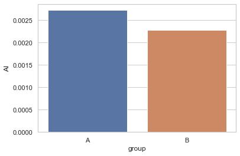


```python
ax = sns.barplot(x="group", y="AW", ci=None, data=a)
```


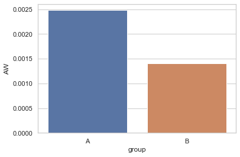


```python
ax = sns.barplot(x="group", y="ocbl", ci=None, data=a)
```


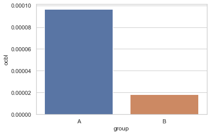


```python
ax = sns.barplot(x="group", y="ocdo", ci=None, data=a)
```


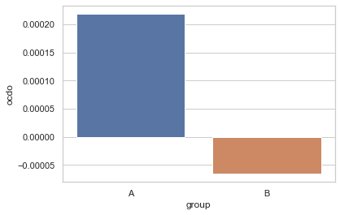


```python
ax = sns.barplot(x="group", y="fpdo", ci=None, data=a)
```


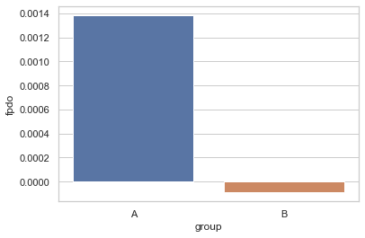


```python
a['time']=a.iloc[:,0:1]
```


```python
a.time
```


    0              0
    1              1
    2              2
    3              3
    4              4
               ...  
    919283    464179
    919284    464180
    919285    464181
    919286    464182
    919287    464183
    Name: time, Length: 919288, dtype: int64


```python
ai=a.pivot(index='time', columns='group', values='ocbl')
```

## 1. Total Occipital Blocking


```python
ai=a.pivot(index='time', columns='group', values='ocbl')

import matplotlib.pyplot as plt
result = pd.DataFrame({
                      'Group A': ai.A,
                       'Group B:':ai.B})

result.plot(title="Total Occipital Blocking: Group A vs B")
plt.axvspan(131000, 161000, color='gray', alpha=0.1)
plt.axvspan(319000, 349000, color='red', alpha=0.1)
plt.gcf().set_size_inches(12,8)
```


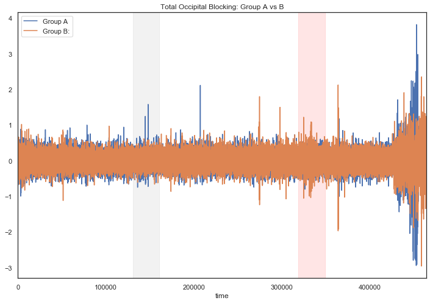


#### 유니세프 광고부분의 ocbl만 비교


```python
result = pd.DataFrame({
                      'Group A': ai.A[131000:161000].reset_index(drop=True),
                       'Group B:':ai.B[319000:349000].reset_index(drop=True)})

result.plot(title="Total Occipital Blocking: Group A vs B")

plt.axvspan(0, 5000, color='gray', alpha=0.2)
plt.gcf().set_size_inches(12,8)
```


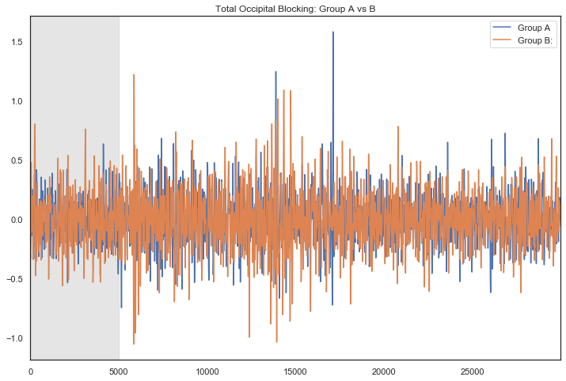


#### 유니세프 광고 0~5초 구간 비교


```python
result = pd.DataFrame({
                      'Group A': ai.A[131000:136000].reset_index(drop=True),
                       'Group B:':ai.B[319000:324000].reset_index(drop=True)})

result.plot(title="Total Occipital Blocking: Group A vs B")

plt.gcf().set_size_inches(12,8)
```


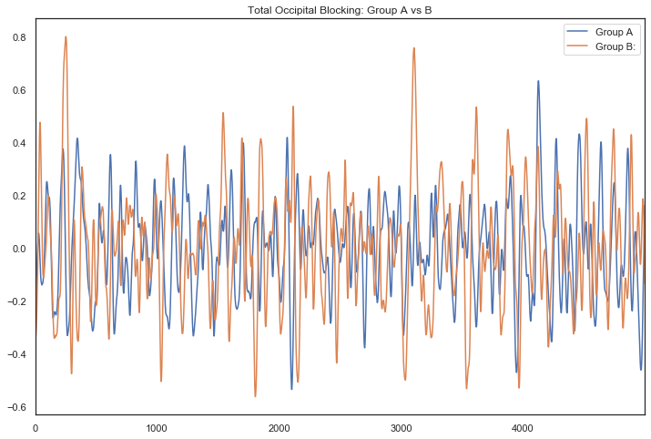


#### 비교를 위해 단순이동평균을 적용


```python
aa=ai.A[131000:136000].reset_index(drop=True)
bb=ai.B[319000:324000].reset_index(drop=True)

N=100
ra = aa.rolling(N).mean()
rb = bb.rolling(N).mean()

result = pd.DataFrame({
                      str(N)+'_SMA_Group A': ra,
                       str(N)+'_SMA_Group B:':rb})


result.plot(title="Attention: Group A vs B")

plt.gcf().set_size_inches(12,8)
plt.axvspan(131000, 161000, color='gray', alpha=0.1)
plt.axvspan(319000, 349000, color='red', alpha=0.1)
plt.show()
```


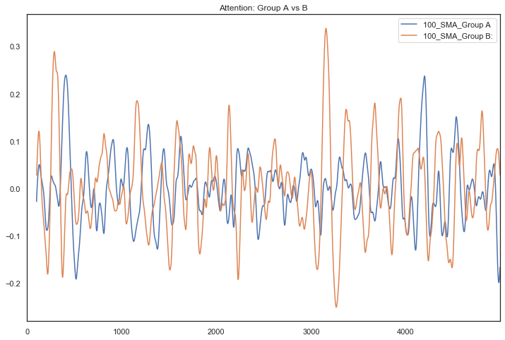


#### 단순평균을 하더라도 비교가 쉽지 않음, 대신에 total occipital 대신에 다른 total occipital의 제곱을 사용, 즉 (o1_alpha+o2_alpha)^2 


```python
result = pd.DataFrame({
                      'Group A': ai.A**2,
                       'Group B:':ai.B**2})

result.plot(title="(Total Occipital Blocking)^2: Group A vs B")
plt.axvspan(131000, 161000, color='gray', alpha=0.1)
plt.axvspan(319000, 349000, color='red', alpha=0.1)
plt.gcf().set_size_inches(12,8)
```


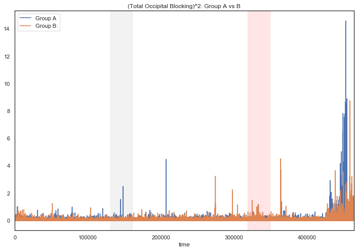


```python
a2=ai.A**2
b2=ai.B**2
```


```python
result = pd.DataFrame({
                      'Group A': a2[131000:161000].reset_index(drop=True),
                       'Group B:':b2[319000:349000].reset_index(drop=True)})

result.plot(title="Total Occipital Blocking: Group A vs B")

plt.axvspan(0, 5000, color='gray', alpha=0.2)
plt.gcf().set_size_inches(12,8)
```


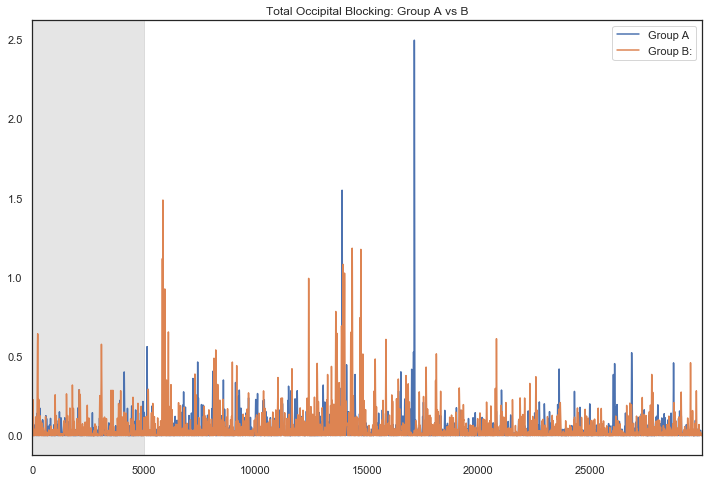


```python
result = pd.DataFrame({
                      'Group A': a2[131000:136000].reset_index(drop=True),
                       'Group B:':b2[319000:324000].reset_index(drop=True)})

result.plot(title="Total Occipital Blocking: Group A vs B")

plt.gcf().set_size_inches(12,8)
```


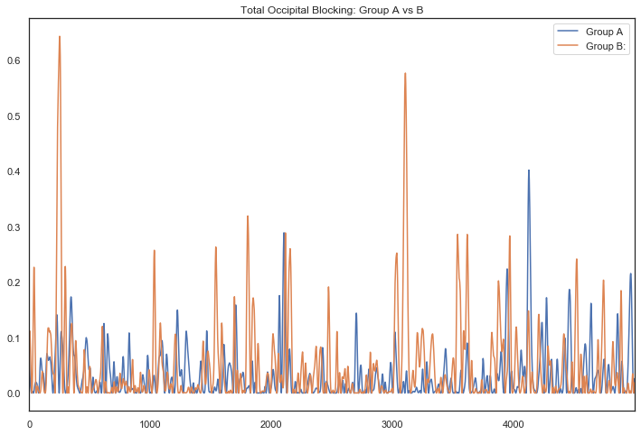


```python
aa=a2[131000:136000].reset_index(drop=True)
bb=b2[319000:324000].reset_index(drop=True)

N=100
ra = aa.rolling(N).mean()
rb = bb.rolling(N).mean()

result = pd.DataFrame({
                      str(N)+'_SMA_Group A': ra,
                       str(N)+'_SMA_Group B:':rb})


result.plot(title="ocbl^2: Group A vs B")

plt.gcf().set_size_inches(12,8)
plt.axvspan(131000, 161000, color='gray', alpha=0.1)
plt.axvspan(319000, 349000, color='red', alpha=0.1)
plt.show()
```


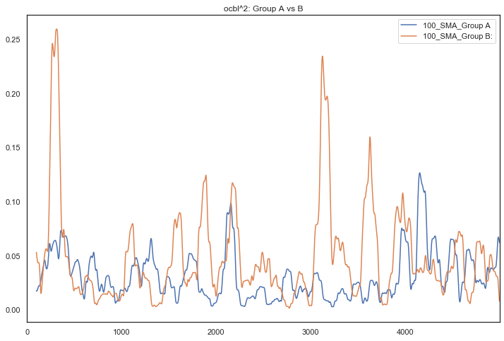


## 2. Attention index

Morgan Cerf와 Manuel Garcia-Garcia(2017)가 Consumer NeuroScience에서 제시한 방법을 따라서 집중도(Attention Index)와 동기(Approach/Withdrawal Index)를 측정했다. 

Attention Index(AI)는 한 피험자의 left frontal alpha값을 제곱한 값을 평균낸 값에 -1을 곱해서 사용한다. 

#### AI = -{(FP1 alpha)^2 + (F3 alpha)^2}/2로 정의했다. 이 AI값이 클수록 집중도가 높은 것이다.  
이 Attention Index는 사람이 무언가에 집중할때 left frontal alpha 값이 감소한다는 Klimesch(1999)와 Petersen과 Posner(2012)의 연구를 바탕으로 Morgan Cerf와 Manuel Garcia-Garcia가 제시한 측정방법이다. 


```python
ai=a.pivot(index='time', columns='group', values='AI')

result = pd.DataFrame({
                      'Group A': ai.A,
                       'Group B:':ai.B})

result.plot(title="Attention: Group A vs B")
plt.gcf().set_size_inches(12,8)
```


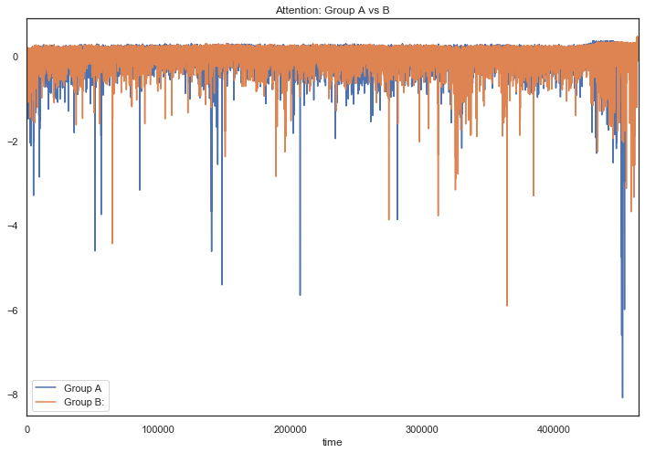


#### 그룹 A, B간의 Attention Index 차이를 비교하기 위해서 단순이동평균을 적용한 결과이다. 1만개 데이터 (10초)로 이동평균 구했다
그 결과 중간광고가 삽입된 시점에서 Attention이 크게 낮아진 것을 확인할 수 있다. 

그래프에서 회색으로 표시된 부분은 A그룹이 중간광고를 시청하는 시간이고, 빨간색으로 표시된 부분은 B그룹이 중간광고를 시청하는 부분이다.


```python
ra_100 = ai.A.rolling(10000).mean()
rb_100 = ai.B.rolling(10000).mean()

result = pd.DataFrame({
                      '10000_MA_Group A': ra_100,
                       '10000_MA_Group B:':rb_100})


sns.set_style("white")
plt.show()
result.plot(title="Attention: Group A vs B")

plt.gcf().set_size_inches(12,8)
plt.axvspan(131000, 161000, color='gray', alpha=0.1)
plt.axvspan(319000, 349000, color='purple', alpha=0.1)
plt.show()
```


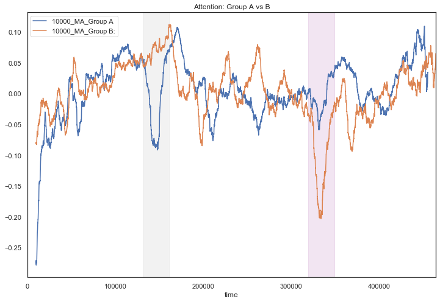


두 그룹의 중간광고 부분만 비교하면 다음과 같다


```python
ra_100 = ai.A.rolling(10000).mean()
rb_100 = ai.B.rolling(10000).mean()

result = pd.DataFrame({
                      '10000_MA_Group A': ra_100[131000:161000].reset_index(drop=True),
                       '10000_MA_Group B:':rb_100[319000:349000].reset_index(drop=True)})


sns.set_style("white")
plt.show()
result.plot(title="Attention: Group A vs B")

plt.gcf().set_size_inches(12,8)
plt.axvspan(131000, 161000, color='gray', alpha=0.1)
plt.axvspan(319000, 349000, color='purple', alpha=0.1)
plt.show()
```


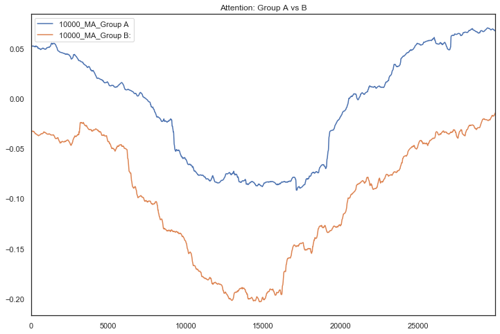


중간광고 앞에 본 영상이 중간광고를 시청하는데 영향을 주지 않아서 중간광고 시작 이후에는 중간광고에 의해서만 Attention이 변한다고 가정했다. 두 그래프를 평행이동하여 시작점 같게 만들어서 비교했다. 


```python
ra_100[131000:]

```


    time
    131000    0.051357
    131001    0.051390
    131002    0.051423
    131003    0.051454
    131004    0.051485
                ...   
    464179         NaN
    464180         NaN
    464181         NaN
    464182         NaN
    464183         NaN
    Name: A, Length: 333184, dtype: float64


```python
rb_100[319000:]
```


    time
    319000   -0.033018
    319001   -0.033011
    319002   -0.033004
    319003   -0.032996
    319004   -0.032988
                ...   
    464179    0.065132
    464180    0.065139
    464181    0.065147
    464182    0.065154
    464183    0.065162
    Name: B, Length: 145184, dtype: float64


```python
result = pd.DataFrame({
                      '10000_MA_Group A': ra_100[131000:161000].reset_index(drop=True)-ra_100[131000:131001].values,
                       '10000_MA_Group B:':rb_100[319000:349000].reset_index(drop=True)+0.033018})


sns.set_style("white")
plt.show()
result.plot(title="Attention: Group A vs B")

plt.gcf().set_size_inches(12,8)
plt.axvspan(131000, 161000, color='gray', alpha=0.1)
plt.axvspan(319000, 349000, color='purple', alpha=0.1)
plt.show()
```


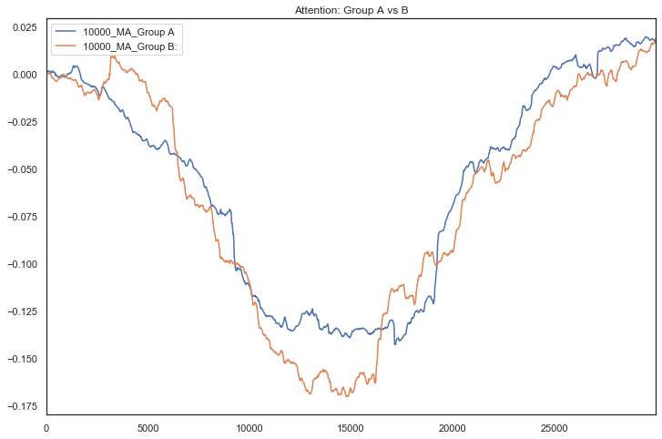


```python
ra_100 = ai.A.rolling(10000).mean()
rb_100 = ai.B.rolling(10000).mean()

result = pd.DataFrame({
                      '10000_MA_Group A': ra_100[131000:161000].reset_index(drop=True),
                       '10000_MA_Group B:':rb_100[319000:349000].reset_index(drop=True)})


sns.set_style("white")
plt.show()
result.plot(title="Attention: Group A vs B")

plt.gcf().set_size_inches(12,8)
plt.axvspan(131000, 161000, color='gray', alpha=0.1)
plt.axvspan(319000, 349000, color='purple', alpha=0.1)
plt.show(
```
Approach/Withdrawal Index(AW)는 마찬가지로 Morgan Cerf와 Manuel Garcia-Garcia가 제시한 방법으로 좌뇌가 긍정적인 감정을 처리하고 우뇌가 부정적인 감정을 처리한다는 Coan과 Allen(2003) 그리고 Davison(2004)의 EEG frontal asymmetry theory에 기반한다. 
우뇌의 알파파 활성이 우세한 경우 Approach, 좌뇌 알파파 활성이 우세한 경우 Withdrawal로 보았다. 

#### AW = {(FP2 alhpa)^2+(F4 alpha)^2}/2 - {(FP1 alpha)^2 + (F3 alpha)^2}/2 이다. AW값이 클수록 우뇌 알파파 활성이 우세하기 때문에 Approach, AW값이 작을수록 Withdrawal 동기를 가졌다고 할 수 있다. 

```python
ra_100 = ai.A.rolling(10000).mean()
rb_100 = ai.B.rolling(10000).mean()

result = pd.DataFrame({
                      '10000_MA_Group A': ra_100,
                       '10000_MA_Group B:':rb_100})


sns.set_style("white")
plt.show()
result.plot(title="Attention: Group A vs B")

plt.gcf().set_size_inches(12,8)
plt.axvspan(131000, 161000, color='purple', alpha=0.1)
plt.axvspan(319000, 349000, color='purple', alpha=0.1)
plt.show()
```


```python
ai=a.pivot(index='time', columns='group', values='AW')

import matplotlib.pyplot as plt
result = pd.DataFrame({
                      'Group A': ai.A,
                       'Group B:':ai.B})

result.plot(title="Approach: Group A vs B")
plt.gcf().set_size_inches(12,8)
```


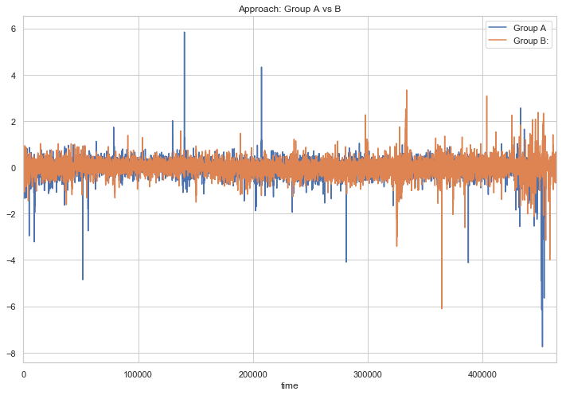


```python
a.head()
```


<div>
<style scoped>
    .dataframe tbody tr th:only-of-type {
        vertical-align: middle;
    }

    .dataframe tbody tr th {
        vertical-align: top;
    }

    .dataframe thead th {
        text-align: right;
    }
</style>
<table border="1" class="dataframe">
  <thead>
    <tr style="text-align: right;">
      <th></th>
      <th>Unnamed: 0</th>
      <th>AI</th>
      <th>AW</th>
      <th>ocbl</th>
      <th>ocdo</th>
      <th>fpdo</th>
      <th>group</th>
      <th>time</th>
    </tr>
  </thead>
  <tbody>
    <tr>
      <th>0</th>
      <td>0</td>
      <td>-0.396279</td>
      <td>-0.526412</td>
      <td>-0.094098</td>
      <td>0.025398</td>
      <td>-0.003526</td>
      <td>A</td>
      <td>0</td>
    </tr>
    <tr>
      <th>1</th>
      <td>1</td>
      <td>-0.390465</td>
      <td>-0.514844</td>
      <td>-0.087199</td>
      <td>0.003968</td>
      <td>-0.000529</td>
      <td>A</td>
      <td>1</td>
    </tr>
    <tr>
      <th>2</th>
      <td>2</td>
      <td>-0.381795</td>
      <td>-0.501314</td>
      <td>-0.082031</td>
      <td>-0.001652</td>
      <td>-0.002208</td>
      <td>A</td>
      <td>2</td>
    </tr>
    <tr>
      <th>3</th>
      <td>3</td>
      <td>-0.371358</td>
      <td>-0.487887</td>
      <td>-0.078589</td>
      <td>-0.001399</td>
      <td>-0.000034</td>
      <td>A</td>
      <td>3</td>
    </tr>
    <tr>
      <th>4</th>
      <td>4</td>
      <td>-0.358849</td>
      <td>-0.474059</td>
      <td>-0.076059</td>
      <td>-0.001235</td>
      <td>-0.000379</td>
      <td>A</td>
      <td>4</td>
    </tr>
  </tbody>
</table>
</div>


```python
ra_100 = ai.A.rolling(10000).mean()
rb_100 = ai.B.rolling(10000).mean()

result = pd.DataFrame({
                      '10000_MA_Group A': ra_100,
                       '10000_MA_Group B:':rb_100})


sns.set_style("white")
plt.show()
result.plot(title="Attention: Group A vs B")

plt.gcf().set_size_inches(12,8)
plt.axvspan(131000, 161000, color='purple', alpha=0.1)
plt.axvspan(319000, 349000, color='purple', alpha=0.1)
plt.show()
```


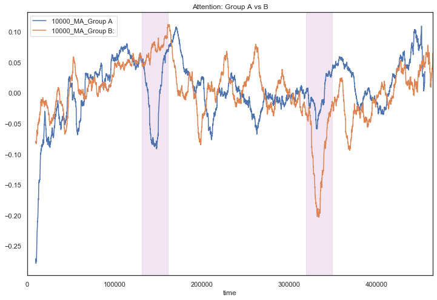


```python
#group A: 2분 11초 >> 131초, group B: 5분 19초 >> 319초
```


    187


```python
100000/1000
```


    100.0


```python
aw=a.pivot(index='time', columns='group', values='AW')
```


```python
result = pd.DataFrame({
                      'Group A': aw.A,
                       'Group B:':aw.B})

result.plot(title=": Group A vs B")
plt.gcf().set_size_inches(12,8)
```


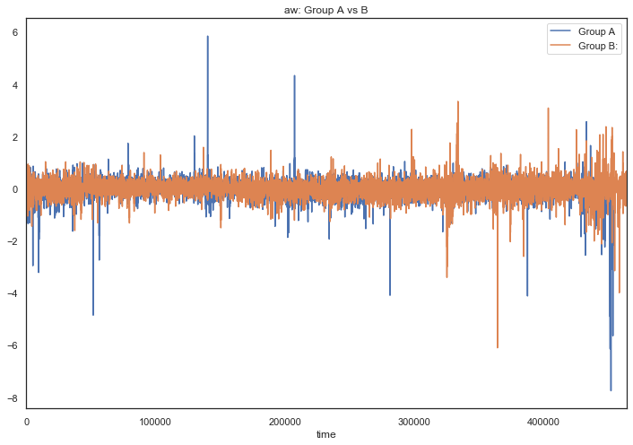


```python
ra_100 = aw.A.rolling(10000).mean()
rb_100 = aw.B.rolling(10000).mean()

result = pd.DataFrame({
                      '10000_MA_Group A': ra_100,
                       '10000_MA_Group B:':rb_100})

result.plot(title="Approach: Group A vs B")
plt.axvspan(131000, 161000, color='purple', alpha=0.1)
plt.axvspan(319000, 349000, color='purple', alpha=0.1)

plt.gcf().set_size_inches(12,8)
```


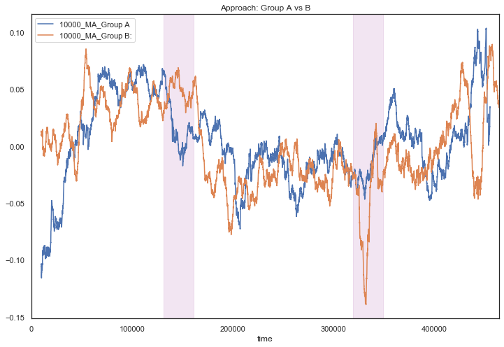


```python
aw[:7000].mean()
```


    group
    A   -0.081578
    B    0.019298
    dtype: float64


```python
awA_bs=aw.A+0.081578
```


```python
awB_bs=aw.B-0.019298
```


```python
N=1000
ra = awA_bs.rolling(N).mean()
rb = awB_bs.rolling(N).mean()

result = pd.DataFrame({
                      str(N)+'_MA_Group A': ra,
                       str(N)+'_MA_Group B:':rb})

result.plot(title="Approach: Group A vs B")
plt.axvspan(131000, 161000, color='purple', alpha=0.1)
plt.axvspan(319000, 349000, color='purple', alpha=0.1)

plt.gcf().set_size_inches(12,8)
```


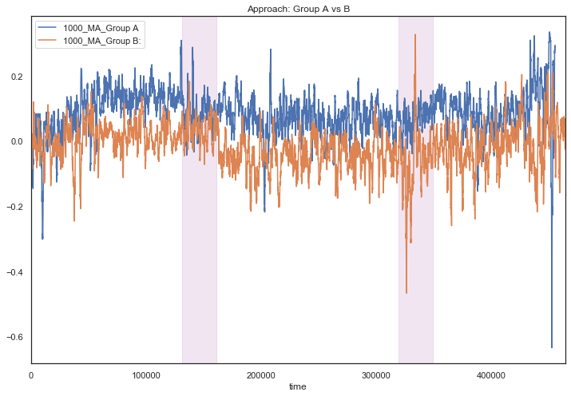


```python
ra[131000:131001]
```


    time
    131000    0.178433
    Name: A, dtype: float64


```python
rb[319000:319001]
```


    time
    319000   -0.065415
    Name: B, dtype: float64


```python
result = pd.DataFrame({
                      '10000_MA_Group A': ra[131000:136000].reset_index(drop=True)-0.178433,
                       '10000_MA_Group B:':rb[319000:324000].reset_index(drop=True)+0.065415})

result.plot(title="Approach: Group A vs B")
plt.axvspan(131000, 161000, color='purple', alpha=0.1)
plt.axvspan(319000, 349000, color='purple', alpha=0.1)

plt.gcf().set_size_inches(12,8)
```


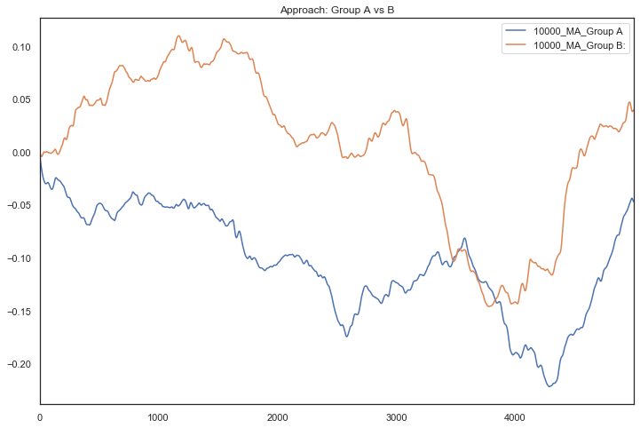


```python
 ra_100[131000:131001]
```


    time
    131000    0.065195
    Name: A, dtype: float64


```python
rb_100[319000:324000]
```


    time
    319000   -0.027078
    319001   -0.027060
    319002   -0.027043
    319003   -0.027028
    319004   -0.027015
                ...   
    323995   -0.041568
    323996   -0.041551
    323997   -0.041534
    323998   -0.041516
    323999   -0.041500
    Name: B, Length: 5000, dtype: float64


```python
ra_100 = aw.A.rolling(10000).mean()
rb_100 = aw.B.rolling(10000).mean()

result = pd.DataFrame({
                      '10000_MA_Group A': ra_100[131000:136000].reset_index(drop=True)-0.065195,
                       '10000_MA_Group B:':rb_100[319000:324000].reset_index(drop=True)+0.027078})

result.plot(title="Approach: Group A vs B")
plt.axvspan(131000, 161000, color='purple', alpha=0.1)
plt.axvspan(319000, 349000, color='purple', alpha=0.1)

plt.gcf().set_size_inches(12,8)
```


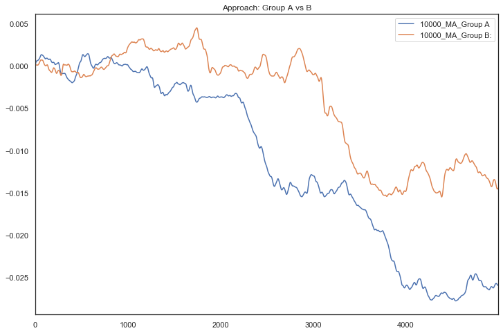


```python
ocbl=a.pivot(index='time', columns='group', values='ocbl')
```


```python
result = pd.DataFrame({
                      'Group A': ocbl.A,
                       'Group B:':ocbl.B})

result.plot(title="ocbl: Group A vs B")
plt.gcf().set_size_inches(12,8)
```


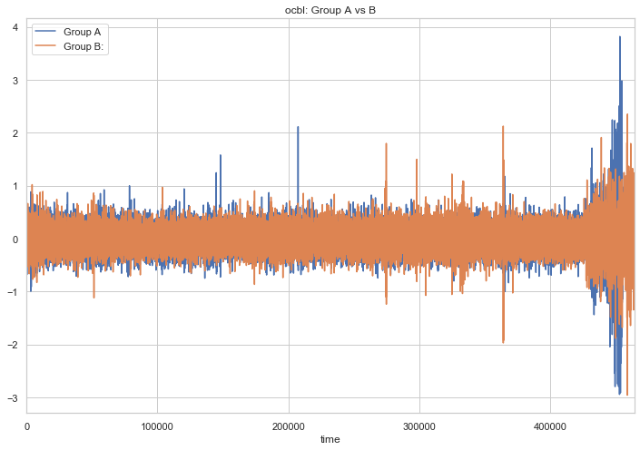


```python
ra_100 = ocbl.A.rolling(100000).mean()
rb_100 = ocbl.B.rolling(100000).mean()

result = pd.DataFrame({
                      '100000_MA_Group A': ra_100,
                       '100000_MA_Group B:':rb_100})

result.plot(title="ocbl: Group A vs B")
plt.gcf().set_size_inches(12,8)
```


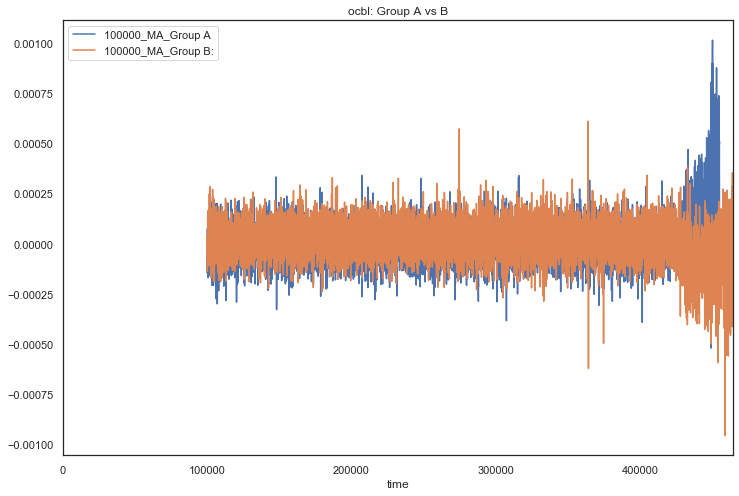


```python
fpdo=a.pivot(index='time', columns='group', values='fpdo')
```


```python
ra_100 = fpdo.A.rolling(1).mean()
rb_100 = fpdo.B.rolling(1).mean()

result = pd.DataFrame({
                      '1000_MA_Group A': ra_100[100000:200000],
                       '1000_MA_Group B:':rb_100[100000:200000]})

result.plot(title="fpdo: Group A vs B")
plt.axvspan(131000, 161000, color='purple', alpha=0.1)
plt.axvspan(319000, 349000, color='purple', alpha=0.1)
plt.gcf().set_size_inches(12,8)
```


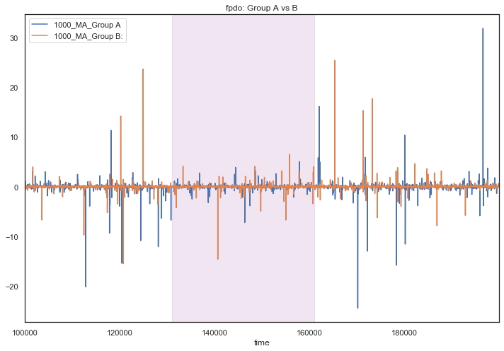


```python
sns.lineplot(x="time", y="AW", hue="group",data=a)
```


    <matplotlib.axes._subplots.AxesSubplot at 0x1db3af3d0>


    /usr/local/Cellar/ipython/7.8.0/libexec/lib/python3.7/site-packages/IPython/core/events.py:88: UserWarning: Creating legend with loc="best" can be slow with large amounts of data.
      func(*args, **kwargs)
    /usr/local/Cellar/ipython/7.8.0/libexec/lib/python3.7/site-packages/IPython/core/pylabtools.py:128: UserWarning: Creating legend with loc="best" can be slow with large amounts of data.
      fig.canvas.print_figure(bytes_io, **kw)


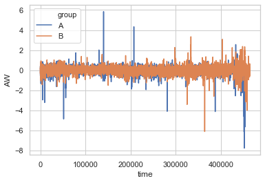


```python
sns.lineplot(x="time", y="AW", hue="group",data=a)
```
